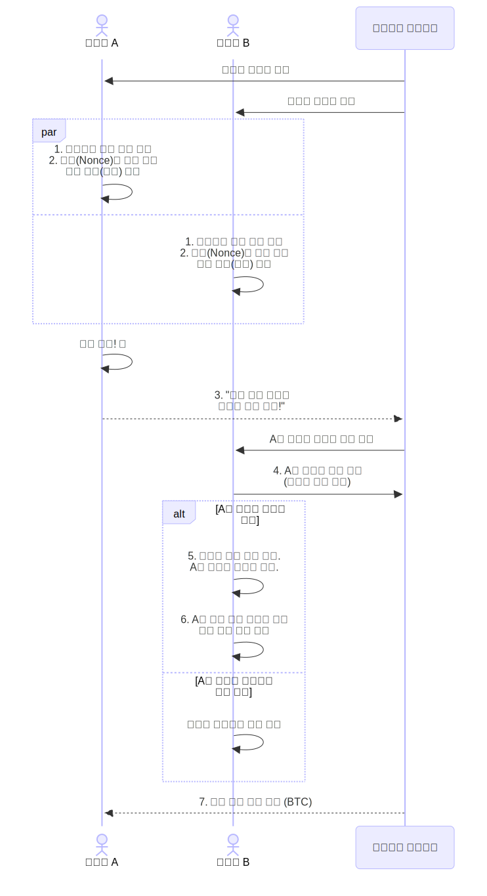
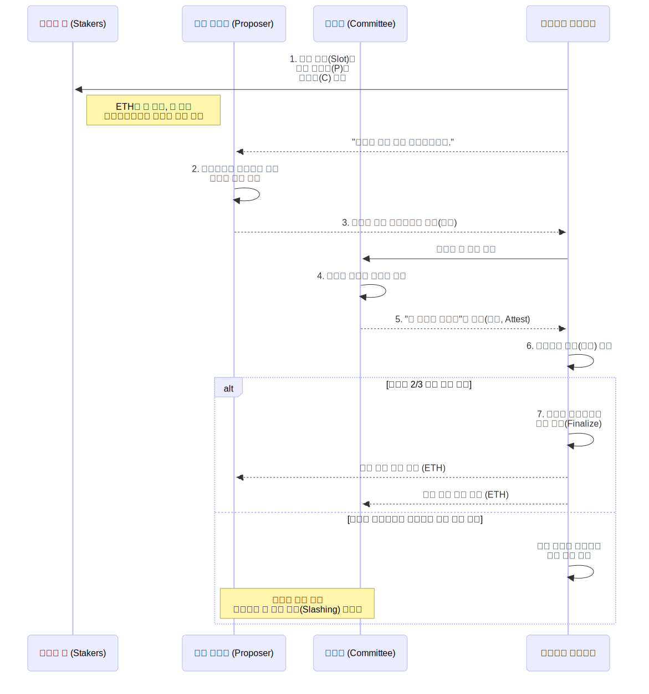

# 비트코인 vs 이더리움

고정하기: No
태그: Blockchain
블로그 게시: No
slug: bitcoin-vs-ethereum

## 합의 알고리즘 비교:

### ⛏️ 비트코인: 작업증명 (Proof of Work) 합의 과정

작업증명은 가장 먼저 **'정답'** 을 찾아낸 채굴자가 블록을 생성할 권리를 갖는 **경쟁 방식**입니다.

### 📜 다이어그램 설명

1. **거래 수집 및 블록 구성**: 모든 채굴자(A, B 등)는 네트워크에 전파된 처리 대기 중인 거래들을 수집하여 새로운 블록 후보를 만듭니다.
2. **채굴 경쟁**: 채굴자들은 블록 헤더의 특정 값(Nonce)을 계속 바꿔가며 전체 해시(hash) 값이 네트워크가 요구하는 목표값보다 작아질 때까지 무차별 대입 연산을 수행합니다. 이 과정이 바로 '작업(Work)'이며, 막대한 컴퓨팅 파워를 소모합니다.
3. **정답 발견 및 전파**: 가장 먼저 정답을 찾아낸 채굴자 A가 완성된 블록과 정답(Proof)을 네트워크 전체에 전파합니다.
4. **검증**: 다른 모든 참여자(채굴자 B 포함)는 A가 보낸 블록과 정답을 즉시 검증합니다. 정답을 찾는 것은 어렵지만, 다른 사람이 찾은 정답이 맞는지 확인하는 것은 매우 쉽고 빠릅니다.
5. **합의 및 연결**: 블록이 유효하다고 확인되면, 다른 채굴자들은 자신이 만들던 블록을 포기하고 A가 만든 블록을 자신의 블록체인 사본에 연결합니다.
6. **새로운 경쟁 시작**: 이제 모든 채굴자는 A가 만든 새로운 블록 바로 다음에 연결될 블록을 만들기 위해 다시 채굴 경쟁을 시작합니다.
7. **보상**: 정답을 찾아 블록을 성공적으로 추가한 채굴자 A는 신규 발행되는 비트코인과 해당 블록에 포함된 거래 수수료를 보상으로 받습니다.

이처럼 가장 긴 체인이 올바른 체인으로 인정받는 **'최장 체인 규칙(Longest Chain Rule)'** 이 비트코인 네트워크의 최종적인 합의를 이끌어냅니다.

---

### 🌱 이더리움: 지분증명 (Proof of Stake) 합의 과정

지분증명은 경쟁이 아닌, 무작위로 선택된 검증인이 블록을 제안하고 다른 검증인들이 투표로 동의하는 **협업 방식**에 가깝습니다.

### 📜 다이어그램 설명

1. **검증인 선정**: 이더리움 네트워크는 각 시간 단위인 '슬롯(Slot, 12초)'마다 블록을 생성할 **'블록 제안자'** 1명과, 해당 블록을 검증할 **'위원회'** 그룹을 전체 검증인 풀에서 알고리즘에 따라 무작위로 선택합니다. ETH를 더 많이 스테이킹했을수록 선택될 확률이 높아집니다.
2. **블록 생성**: 선택된 '블록 제안자'는 네트워크의 거래들을 모아 새로운 블록을 만듭니다.
3. **블록 제안**: '블록 제안자'는 생성한 블록을 네트워크에 전파합니다.
4. **검증**: '위원회'로 선택된 검증인들은 제안된 블록을 받아 그 내용이 유효한지(서명, 트랜잭션 등) 확인합니다.
5. **증명 (Attestation)**: 블록이 유효하다고 판단한 위원회 멤버들은 "이 블록은 유효하다"는 내용의 서명 데이터를 네트워크에 보냅니다. 이것이 일종의 '투표' 행위입니다.
6. **합의 형성**: 네트워크는 위원회로부터 충분한 수(보통 2/3 이상)의 긍정적인 증명(투표)이 모였는지 확인합니다.
7. **최종 확정 및 보상**: 충분한 증명이 모이면 해당 블록은 '최종 확정'된 것으로 간주되어 블록체인에 안전하게 연결됩니다. 이후 블록을 제안한 '제안자'와 투표에 참여한 '위원회' 멤버들은 모두 소량의 ETH를 보상으로 받습니다. 만약 검증인이 악의적인 행동을 하거나 자리를 비우면 보증금(스테이킹된 ETH)이 삭감되는 **'슬래싱(Slashing)'** 페널티를 받게 되어 정직한 참여를 유도합니다.

---

## 송금 방식 비교:

### 🪙 비트코인: '코인(UTXO)' 조각들을 주고받는 방식

비트코인은 우리가 생각하는 '계좌' 개념이 없습니다. 대신 **'사용되지 않은 거래 출력값(UTXO, Unspent Transaction Output)'** 이라는 **'코인' 조각들**을 추적하는 방식을 사용합니다. 이는 마치 **현금**을 사용하는 것과 매우 유사합니다.

지갑에 10,000원짜리 지폐 한 장, 5,000원짜리 지폐 한 장이 있는 상황을 상상해 보세요. 이때 나의 '잔액'은 15,000원이지만, 이는 '15,000원'이라는 숫자 하나로 저장된 것이 아니라 '10,000원권'과 '5,000원권'이라는 실물 지폐의 합입니다.

비트코인의 UTXO가 바로 이 지폐와 같습니다.

### **송금 과정 (3 BTC를 보내는 예시)**

1. **내 지갑 상태**: 제 지갑에는 이전에 받은 2 BTC짜리 '코인' 조각(UTXO)과 5 BTC짜리 '코인' 조각이 있습니다. 제 잔액은 총 7 BTC입니다.
2. **송금**: 친구에게 3 BTC를 보내려고 합니다. 2 BTC 조각만으로는 부족하므로, **5 BTC짜리 '코인' 조각을 통째로 사용**합니다. (마치 3,000원짜리 커피를 사기 위해 5,000원짜리 지폐를 내는 것과 같습니다.)
3. **거래 발생**:
    - 제가 가진 5 BTC짜리 '코인' 조각은 **사라집니다** (사용됨).
    - 친구는 **새로운 3 BTC짜리 '코인' 조각**을 받게 됩니다.
    - 저는 **거스름돈으로 새로운 2 BTC짜리 '코인' 조각**을 돌려받습니다.
4. **송금 후 내 지갑 상태**: 이제 제 지갑에는 원래 있던 2 BTC짜리 '코인'과 거스름돈으로 받은 2 BTC짜리 '코인', 총 두 개의 '코인' 조각이 남게 됩니다. 잔액은 4 BTC입니다.

**핵심 특징:**

- **잔액은 실체가 없다**: 비트코인 블록체인에는 '계좌 잔액' 정보가 없습니다. 지갑 프로그램이 내가 가진 '코인(UTXO)' 조각들을 실시간으로 모두 더해서 보여주는 것뿐입니다.
- **프라이버시**: 거래할 때마다 거스름돈을 새로운 주소로 받을 수 있어 거래 흐름을 추적하기가 상대적으로 더 복잡합니다.
- **단순성**: 오직 '코인'의 이동만 추적하므로 구조가 단순하고 강력합니다.

---

### 🏦 이더리움: 은행 '계정(Account)'에서 잔액을 옮기는 방식

이더리움은 우리에게 익숙한 **은행 계좌 시스템**과 거의 동일한 **'계정 기반(Account-based)' 모델**을 사용합니다. 블록체인 자체가 모든 참여자의 **'계정'** 과 그 **'잔액'** 을 직접 기록하고 관리합니다.

### **송금 과정 (3 ETH를 보내는 예시)**

1. **내 계정 상태**: 제 이더리움 계정에는 '7 ETH'라는 **잔액이 숫자**로 명확하게 기록되어 있습니다.
2. **송금**: 친구에게 3 ETH를 보냅니다.
3. **거래 발생**: 이 거래는 "**내 계정 잔액에서 3 ETH를 빼고, 친구 계정 잔액에 3 ETH를 더하라**"는 간단한 명령을 네트워크에 전송하는 것과 같습니다.
4. **송금 후 내 계정 상태**: 블록체인의 '글로벌 상태'가 업데이트됩니다. 제 계정 잔액은 '4 ETH'로 변경되고, 친구의 계정 잔액은 3 ETH만큼 늘어납니다.

**핵심 특징:**

- **명확한 잔액**: 각 계정의 잔액이 블록체인에 직접 저장되어 있어 상태를 파악하기 쉽습니다.
- **스마트 계약에 유리**: 잔액이 명확한 숫자로 관리되므로, "계정 잔액이 10 ETH 이상이면 A를 실행하라"와 같은 복잡한 조건의 스마트 계약을 만들기 훨씬 수월합니다.
- **직관성**: 사용자가 이해하기 쉽고 개발자가 다루기 편리합니다. 은행 시스템과 유사하기 때문입니다.

### 한눈에 보는 비교

| 구분 | **비트코인 (Coin-centric)** | **이더리움 (Account-centric)** |
| --- | --- | --- |
| **모델** | UTXO 모델 | 계정 기반 모델 |
| **핵심** | 🪙 사용 가능한 **'코인' 조각들**의 집합 | 🔢 각 **'계정'** 에 기록된 숫자 잔액 |
| **비유** | **현금 지갑** (여러 장의 지폐와 동전) | **은행 계좌** (하나의 잔액 숫자) |
| **거래 방식** | 코인 조각을 쓰고 거스름돈을 받는 방식 | 계좌 잔액을 직접 증감시키는 방식 |
| **장점** | 구조의 단순성, 잠재적 프라이버시 | 스마트 계약 구현 용이, 직관성 |
| **단점** | 스마트 계약 구현이 복잡함 | 거래 재사용 공격 방지를 위한 '논스' 필요 |

결론적으로 비트코인은 **'디지털 현금'** 이라는 철학에 맞춰 각각의 '코인'을 독립적으로 다루는 데 최적화되어 있고, 이더리움은 **'분산 슈퍼컴퓨터'** 라는 목표에 맞춰 다양한 프로그램(스마트 계약)이 쉽게 상호작용할 수 있도록 '계정' 시스템을 채택했습니다.