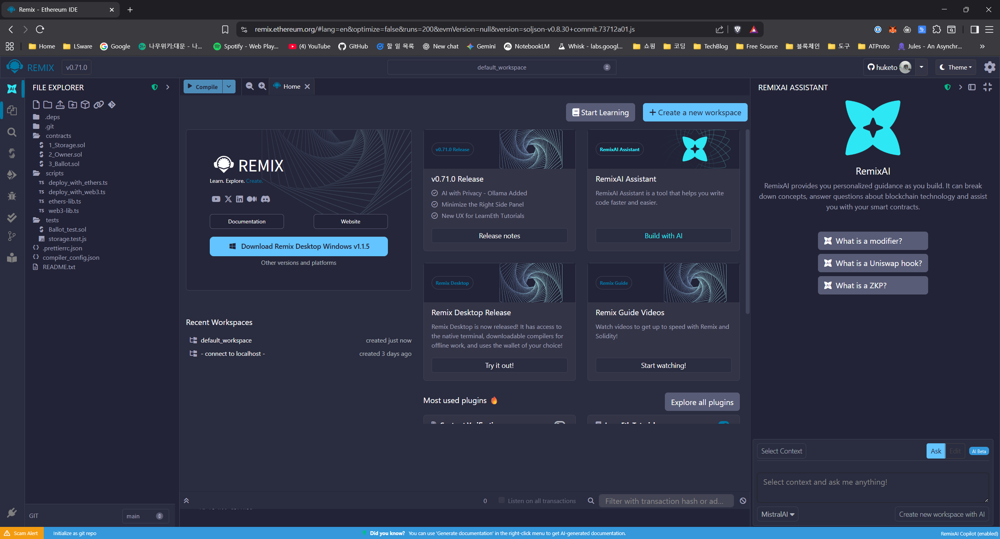
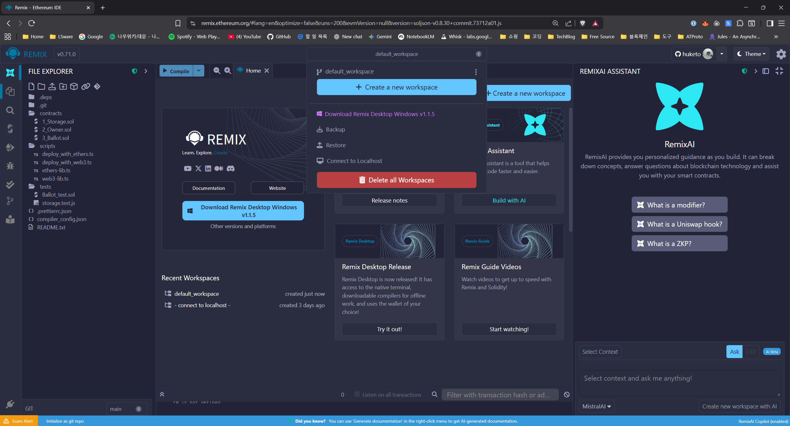
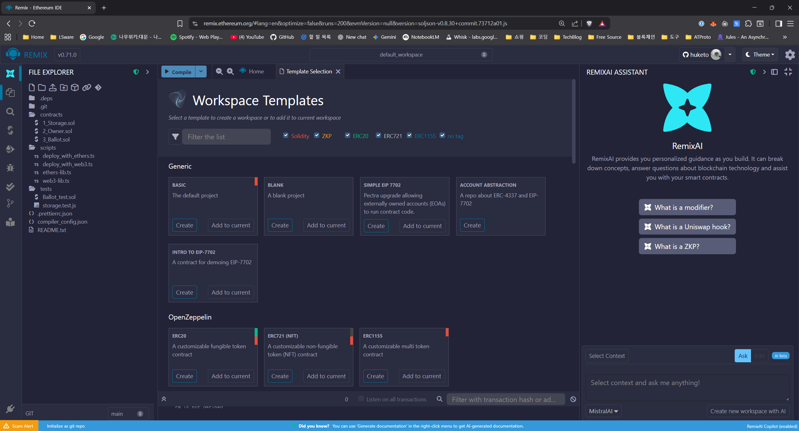
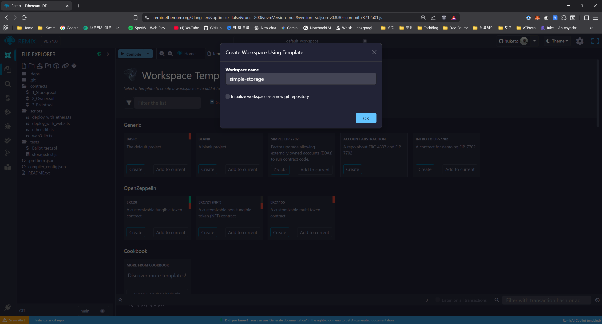
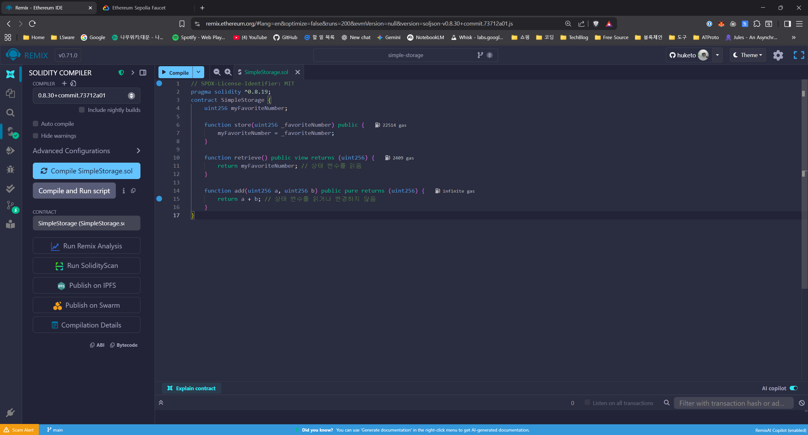
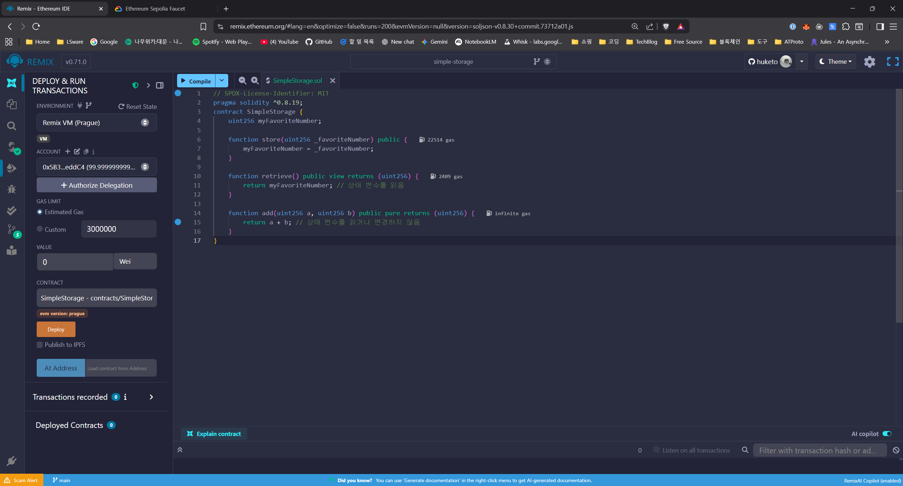
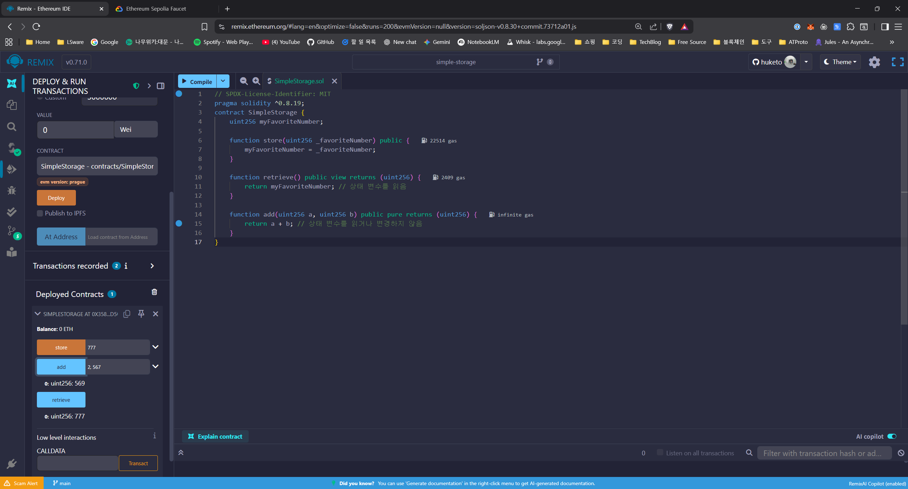

# Solidity 프로그래밍 핵심

## 📜 들어가며: Solidity란?

**Solidity**는 이더리움과 같은 EVM(Ethereum Virtual Machine) 기반 블록체인에서 스마트 컨트랙트를 작성하기 위해 만들어진 가장 대표적인 프로그래밍 언어입니다. C++, Python, JavaScript 등 여러 언어의 영향을 받아 정적 타입(statically-typed) 언어로 설계되었습니다.

Solidity로 작성된 코드는 컴파일 과정을 거쳐 EVM이 이해할 수 있는 **바이트코드(Bytecode)** 로 변환된 후, 블록체인에 배포됩니다. 이번 시간에는 스마트 컨트랙트의 뼈대를 이루는 Solidity의 핵심 문법과 개념들을 알아보겠습니다.

---

이 문서는 Solidity 스마트 컨트랙트 개발의 기초부터 핵심 개념까지 단계별로 학습할 수 있도록 제작되었습니다. 각 섹션의 코드 예제를 Remix IDE에 직접 작성하고 실행하며 따라오시는 것을 권장합니다.

[Contracts 폴더](./contracts/) 에는 각 섹션별 완성된 Solidity 코드가 포함되어 있습니다. 각 섹션의 설명을 참고하여 직접 코드를 작성해보세요.

---

## Remix IDE Workspace 설정

[Remix IDE](https://remix.ethereum.org/)는 웹 기반의 Solidity 개발 환경으로, 별도의 설치 없이 브라우저에서 바로 스마트 컨트랙트를 작성, 컴파일, 배포할 수 있습니다. _Remix IDE Desktop_ 버전도 있지만, 이 문서에서는 웹 버전을 기준으로 설명합니다.

Remix IDE 메인 화면은 다음과 같이 구성되어 있습니다:



</br>

Workspace 선택 버튼 클릭

`Create a new workspace` 버튼 클릭:



</br>

Workspace 템플릿 선택:



</br>

`BLANK` 템플릿 선택 후 `simple-storage`로 생성:



</br>

---

## Section 1: Simple Storage

### 📋 프로젝트 소개

**Simple Storage**는 가장 기본적인 스마트 컨트랙트로, 숫자를 저장하고 읽을 수 있는 기능을 제공합니다. 또한 사람들의 이름과 좋아하는 숫자를 관리하는 간단한 데이터베이스 역할도 합니다. 블록체인에 데이터를 영구적으로 저장하는 방법을 배울 수 있는 완벽한 첫 번째 프로젝트입니다.

### 🎯 학습 목표

이 섹션에서는 다음 핵심 개념들을 학습합니다:

- Solidity 파일의 기본 구조 (라이선스, pragma, contract)
- 기본 데이터 타입 (uint256, string)
- 상태 변수와 함수
- 구조체(struct)와 배열(array)
- 매핑(mapping)과 빠른 데이터 검색
- 메모리 위치 (storage, memory, calldata)

### 1. Introduction & Setting Up Your First Contract

우선 Remix IDE에서 `SimpleStorage.sol` 파일을 생성하고,  Solidity 파일의 기본 구조를 작성해봅시다.

1. `contracts` 폴더 생성
2. `contracts` 폴더 안에 `SimpleStorage.sol` 파일 생성


</br>

먼저 모든 Solidity 파일의 기본 구조부터 만들어보겠습니다:

```solidity
// SPDX-License-Identifier: MIT
pragma solidity 0.8.19;

contract SimpleStorage {
    // 여기에 코드를 작성해나갈 예정입니다
}
```

- **SPDX-License-Identifier**: 소스 코드의 라이선스를 명시하는 주석입니다. 오픈소스 프로젝트에서 매우 중요합니다.
- **pragma solidity 0.8.19**: 이 코드를 컴파일할 솔리디티 컴파일러의 버전을 지정합니다. `^0.8.20`는 0.8.19 버전 이상, 0.9.0 미만 버전에서 컴파일 가능하다는 의미입니다.
  - `pragma solidity >=0.8.0 <0.9.0;` 처럼 범위를 지정할 수도 있습니다.
- **contract SimpleStorage { ... }**: 모든 Solidity 코드는 `contract` 라는 키워드로 시작하는 계약 블록 안에 작성됩니다.

### 2. Basic Solidity: Types

이제 컨트랙트 안에 첫 번째 변수를 추가해봅시다:

```solidity
// SPDX-License-Identifier: MIT
pragma solidity 0.8.19;

contract SimpleStorage {
    uint256 myFavoriteNumber;
}
```

- `uint256`: 부호 없는 256비트 정수(0과 양수만 해당)를 의미합니다. 이더리움에서 가장 흔하게 사용되는 숫자 타입입니다. `myFavoriteNumber`가 이 타입입니다.
- `string`: 문자열을 의미합니다. (다음 단계에서 사용할 예정입니다)
- 변수는 선언 시 값을 할당하지 않으면 `0`, `false`, `""` 등 타입별 기본값으로 초기화됩니다.

</br>

변수 선언과 동시에 초기값을 할당할 수도 있습니다:

```solidity
// SPDX-License-Identifier: MIT
pragma solidity ^0.8.20;

contract SimpleStorage {
    uint256 myFavoriteNumber = 777;
}
```

#### 2.1. Basic Data Types in Solidity

Solidity에서 자주 사용되는 기본 데이터 타입들은 다음과 같습니다:

| 타입      | 설명                                   | 예시                                          |
| --------- | -------------------------------------- | --------------------------------------------- |
| `uint`    | 부호 없는 정수 (0과 양수)              | `uint256`, `uint8`                            |
| `int`     | 부호 있는 정수 (음수와 양수)           | `int256`, `int8`                              |
| `bool`    | 불리언 값 (참 또는 거짓)               | `true`, `false`                               |
| `address` | 이더리움 주소 (20바이트)               | `0x80CDA1c403bBC1ceFD03C2Fb2A3FEdc19eD9D790`  |
| `string`  | 문자열 (텍스트)                        | `"Hello, World!"`                             |
| `bytes`   | 바이트 배열 (고정 길이 또는 동적 길이) | `bytes32`, `bytes`                            |
| `enum`    | 열거형 (관련된 상수들의 집합)          | `enum Status { Pending, Shipped, Delivered }` |

```solidity
// SPDX-License-Identifier: MIT
pragma solidity ^0.8.20;

contract SimpleStorage {
    uint256 myFavoriteNumber = 777; // 0 ~ 2^256-1
    uint8 someNum = 255; // 0~255
    int256 someInt = -123; // -2^255 ~ 2^255-1
    string public myName = "Alice"; // 제한 없는 길이의 문자열, 실제로는 가스비로 인해서 길이 제한이 있음
    bool isActive = true; // true or false
    address public myAddress = 0x80CDA1c403bBC1ceFD03C2Fb2A3FEdc19eD9D790; // 20 bytes, 0x로 시작
    bytes32 public myHash = keccak256(abi.encodePacked(myName, myAddress)); // 32 bytes
    enum Status {
        Pending, // 0
        Shipped, // 1
        Delivered // 2
    }
}
```

- `uint8 someNum = 255;`:
  - `uint8`는 0부터 255까지의 값을 가질 수 있는 부호 없는 8비트 정수입니다. (2^8 = 256)
  - `uint256`보다 메모리를 덜 사용하지만, EVM에서는 32바이트(256비트) 단위로 데이터를 처리하기 때문에 실제 가스비 차이는 크지 않습니다.
  - 따라서, 특별한 이유가 없다면 `uint256`을 주로 사용합니다.
  - `uint`는 기본적으로 `uint256`과 동일합니다.
- `int8`는 -128부터 127까지의 값을 가질 수 있는 부호 있는 8비트 정수입니다. (2^7 = 128)
  - `int`는 기본적으로 `int256`과 동일합니다.
  - `int`와 `uint`는 음수와 양수를 모두 표현할 수 있는지 여부에 따라 선택합니다.
- `string public myName = "Alice";`:
  - `public` 키워드를 붙이면 컴파일러가 자동으로 이 변수에 대한 getter 함수를 생성해줍니다. 따라서 외부에서 `myName()` 함수를 호출하여 값을 조회할 수 있습니다.
  - `string` 타입은 길이에 제한이 없지만, 실제로는 너무 긴 문자열을 저장하면 가스비가 많이 들기 때문에 주의해야 합니다.
- `address public myAddress = 0x80CDA1c403bBC1ceFD03C2Fb2A3FEdc19eD9D790;`:
  - `address` 타입은 이더리움 주소를 저장하는 데 사용됩니다. 20바이트(160비트) 크기입니다.
  - `0x`로 시작하는 16진수 문자열로 표현됩니다.
- `bytes32 public myHash = keccak256(abi.encodePacked(myName, myAddress));`:
  - `bytes32`는 고정 길이 32바이트 배열을 의미합니다.
  - `keccak256` 함수는 입력값의 해시 값을 계산하는데 사용됩니다. 이는 블록체인에서 데이터 무결성을 확인하는 데 자주 사용됩니다.
  - `abi.encodePacked(...)`는 여러 값을 바이트 배열로 인코딩하는 함수입니다.

---

### 3. Basic Solidity: Functions

이제 우리의 변수를 다룰 수 있는 함수들을 추가해봅시다:

```solidity
// SPDX-License-Identifier: MIT
pragma solidity ^0.8.20;

contract SimpleStorage {
    uint256 myFavoriteNumber;

    function store(uint256 _favoriteNumber) public {
        myFavoriteNumber = _favoriteNumber;
    }

    function retrieve() public view returns (uint256) {
        return myFavoriteNumber;
    }
}
```

- **`store(uint256 _favoriteNumber) public`**:
  - `_favoriteNumber`라는 `uint256` 타입의 입력값을 받아 상태 변수 `myFavoriteNumber`에 저장하는 함수입니다.
  - 블록체인의 상태를 **변경**하므로 실행 시 가스(수수료)가 필요합니다.
  - `public`은 이 함수가 컨트랙트 외부에서도 호출될 수 있음을 의미하는 **가시성(Visibility)** 지정자입니다.
- **`retrieve() public view returns (uint256)`**:
  - 상태 변수 `myFavoriteNumber`의 값을 **읽어서 반환**하는 함수입니다.
  - `view` 키워드는 이 함수가 블록체인의 상태를 변경하지 않음을 명시합니다. 따라서 가스 소모 없이 호출할 수 있습니다.
  - `returns (uint256)`는 이 함수가 `uint256` 타입의 값을 반환함을 의미합니다.

---

#### 3.1. 가시성 지정자 (Visibility Specifiers)

Solidity에서 함수의 가시성(Visibility)은 해당 함수가 어디에서 호출될 수 있는지를 결정합니다. 주요 가시성 지정자는 다음과 같습니다:

- **public**: 외부에서 호출 가능하며, 다른 계약이나 계정에서도 접근할 수 있습니다.
- **private**: 해당 계약 내부에서만 호출 가능하며, 상속받은 계약에서도 접근할 수 없습니다.
- **internal**: 해당 계약 및 상속받은 계약에서 호출 가능하지만, 외부에서는 접근할 수 없습니다.
- **external**: 외부에서만 호출 가능하며, 계약 내부에서는 호출할 수 없습니다.

> 변수도 마찬가지로 `public`, `private`, `internal` 가시성 지정자를 사용할 수 있습니다. `public`으로 선언된 상태 변수는 자동으로 getter 함수가 생성되어 외부에서 값을 조회할 수 있습니다.
> 예를 들어, `uint256 public myFavoriteNumber;`로 선언하면 `myFavoriteNumber()`라는 getter 함수가 자동으로 생성됩니다.
> 아무 지정자 없이 선언된 변수는 기본적으로 `internal`로 간주됩니다.

```solidity
// SPDX-License-Identifier: MIT
pragma solidity ^0.8.20;

contract SimpleStorage {
    uint256 myFavoriteNumber;

    function store(uint256 _favoriteNumber) public {
        myFavoriteNumber = _favoriteNumber;
    }

    function retrieve() public view returns (uint256) {
        return myFavoriteNumber;
    }

    function privateFunction() private {
        // 이 함수는 오직 이 계약 내부에서만 호출될 수 있습니다.
    }

    function internalFunction() internal {
        // 이 함수는 이 계약과 상속받은 계약에서 호출될 수 있습니다.
    }
}
```

#### 3.2. 상태 변경성 지정자 (State Mutability Specifiers)

Solidity에서 함수가 블록체인의 상태를 변경하는지 여부에 따라 `view`와 `pure` 키워드를 사용합니다:

- **view**: 함수가 상태 변수를 읽을 수 있지만, 변경하지 않는다는 것을 나타냅니다. 예를 들어, `retrieve()` 함수는 `myFavoriteNumber`를 읽기만 하므로 `view`로 선언됩니다.
- **pure**: 함수가 상태 변수를 읽거나 변경하지 않음을 나타냅니다. 예를 들어, 두 숫자를 더하는 단순한 계산 함수는 `pure`로 선언될 수 있습니다.

```solidity
// SPDX-License-Identifier: MIT
pragma solidity ^0.8.20;
contract SimpleStorage {
    uint256 myFavoriteNumber;

    function store(uint256 _favoriteNumber) public {
        myFavoriteNumber = _favoriteNumber;
    }

    function retrieve() public view returns (uint256) {
        return myFavoriteNumber; // 상태 변수를 읽음
    }

    function add(uint256 a, uint256 b) public pure returns (uint256) {
        return a + b; // 상태 변수를 읽거나 변경하지 않음
    }
}
```

#### 3.3. Compile & Deploy

이제 Remix IDE에서 코드를 컴파일하고 배포해봅시다:

1. 왼쪽 사이드바에서 **Solidity 컴파일러** 아이콘(3 번째 아이콘)을 클릭합니다.



</br>

2. `SimpleStorage.sol` 파일이 선택된 상태에서 **컴파일(SimpleStorage.sol)** 버튼을 클릭합니다.

> 컴파일러 버전이 `pragma`에 지정된 버전과 일치하는지 확인하세요. 일치하지 않으면 오류가 발생할 수 있습니다.
> 컴파일이 성공하면 초록색 체크 표시가 나타납니다.
> _Tip: Auto compile 옵션을 켜두면 파일을 저장할 때마다 자동으로 컴파일됩니다._

</br>

3. 왼쪽 사이드바에서 **배포 및 실행 트랜잭션** 아이콘(4 번째 아이콘)을 클릭합니다.



</br>

- Remix IDE는 개발을 위한 가상 환경을 제공합니다. 기본적으로 **Remix VM** 환경이 선택되어 있습니다. `(Pargue)` 는 이더리움 업데이트 버전의 이름입니다.
- `SimpleStorage` 컨트랙트가 선택된 상태에서 **배포(Deploy)** 버튼을 클릭합니다.
- 배포가 성공하면 아래의 **Deployed Contracts** 섹션에 `SimpleStorage` 인스턴스가 나타납니다.

</br>

4. 배포된 컨트랙트를 확장하면 `store`와 `add`, `retrieve` 함수가 보입니다.



</br>

---

### 4. Basic Solidity: Arrays & Structs

이제 더 복잡한 데이터 구조를 추가해봅시다. 여러 사람의 정보를 저장할 수 있는 구조체와 배열을 만들어보겠습니다:

```solidity
// SPDX-License-Identifier: MIT
pragma solidity ^0.8.20;

contract SimpleStorage {
    uint256 myFavoriteNumber;

    struct Person {
        uint256 favoriteNumber;
        string name;
    }
    
    Person[] public listOfPeople;

    function store(uint256 _favoriteNumber) public {
        myFavoriteNumber = _favoriteNumber;
    }

    function retrieve() public view returns (uint256) {
        return myFavoriteNumber;
    }
}
```

- **`struct Person { ... }`**:
  - `favoriteNumber`와 `name`이라는 관련 있는 데이터들을 `Person`이라는 하나의 사용자 정의 타입으로 묶어줍니다.
- **`Person[] public listOfPeople;`**:
  - `Person` 구조체를 여러 개 담을 수 있는 **동적 배열(Dynamic Array)** 입니다. `public`으로 선언하면 컴파일러가 자동으로 이 배열의 내용을 조회할 수 있는 getter 함수를 만들어줍니다.
  - `listOfPeople.push(...)` 코드를 통해 배열에 새로운 요소를 추가할 수 있습니다. (다음 단계에서 구현해보겠습니다)
  
</br>

#### 4.1. Arrays in Solidity

Solidity에서 배열은 동일한 타입의 여러 값을 저장할 수 있는 데이터 구조입니다. 배열은 고정 길이(Fixed-size)와 동적 길이(Dynamic-size)로 나눌 수 있습니다:

- **고정 길이 배열**: 선언 시 크기가 정해지며, 이후 변경할 수 없습니다.
- **동적 길이 배열**: 크기가 유동적이며, `push` 메서드를 사용해 요소를 추가할 수 있습니다.

```solidity
// SPDX-License-Identifier: MIT
pragma solidity ^0.8.20;

contract SimpleStorage {
    string[3] public fixedArray = ["Hello", "World", "!"]; // 고정 길이 배열 (길이 3)
    string[] public dynamicArray; // 동적 길이 배열

    function pushToDynamicArray(string memory _value) public {
        dynamicArray.push(_value); // 동적 배열에 요소 추가
    }

    function popFromDynamicArray() public {
        dynamicArray.pop(); // 동적 배열에서 마지막 요소 제거
    }

    function changeFixedArrayElement(uint256 index, string memory _value) public {
        fixedArray[index] = _value; // 고정 배열의 특정 요소 변경
    }

    function getDynamicArrayLength() public view returns (uint256) {
        return dynamicArray.length; // 동적 배열의 길이 반환
    }
}
```

- **`string[3] public fixedArray`**:
  - 길이가 3으로 고정된 문자열 배열입니다. 인덱스는 0부터 시작합니다.
  - `fixedArray[0]`, `fixedArray[1]`, `fixedArray[2]`로 각각 접근할 수 있습니다.
  - 고정 길이 배열은 메모리 사용이 더 효율적이지만, 크기를 변경할 수 없다는 단점이 있습니다.
- **`string[] public dynamicArray`**:
  - 길이가 유동적인 문자열 배열입니다. `push` 메서드를 사용해 원하는 만큼 요소를 추가할 수 있습니다.
  - `dynamicArray.length`로 현재 배열의 길이를 확인할 수 있습니다.
  - 동적 배열은 유연하지만, 메모리 사용이 더 많고 가스비가 더 들 수 있습니다.
  - `pop` 메서드를 사용해 마지막 요소를 제거할 수도 있습니다.
- 배열의 특정 요소에 접근하거나 변경할 때는 인덱스를 사용합니다. 예를 들어, `dynamicArray[0]`은 배열의 첫 번째 요소를 의미합니다.


#### 4.2. Structs in Solidity

Solidity에서 구조체(Struct)는 관련된 여러 데이터를 하나의 복합 타입으로 묶어주는 사용자 정의 데이터 타입입니다. 구조체를 사용하면 코드의 가독성과 유지보수성이 향상됩니다.

```solidity
// SPDX-License-Identifier: MIT
pragma solidity ^0.8.20;

contract SimpleStorage {
    struct Person {
        string name;
        string country;
        uint8 age;
        address wallet;
    }
    
    // 구조체 할당 방법 1: 위치 기반 할당
    Person public alice = Person("Alice", "Wonderland", 20, 0x80CDA1c403bBC1ceFD03C2Fb2A3FEdc19eD9D790);
    // 구조체 할당 방법 2: 키-값 쌍 할당
    Person public kim = Person({
        name: "Kim",
        country: "Korea",
        age: 30,
        wallet: 0xC212a6bFbb0b765e71323a5C613247749cb49e36
    });
}
```

- **`struct Person { ... }`**:
  - `name`, `country`, `age`, `wallet`이라는 서로 관련된 데이터를 하나의 `Person` 구조체로 묶어줍니다.
  - 각 필드는 서로 다른 타입을 가질 수 있습니다.
  - 구조체는 컨트랙트 내에서 여러 번 재사용할 수 있습니다.
  - 구조체는 배열, 매핑 등 다른 데이터 구조와 결합하여 더 복잡한 데이터를 관리할 수 있습니다.
  - 구조체는 상태 변수로 선언할 수도 있고, 함수 내에서 지역 변수로 사용할 수도 있습니다.
- **구조체 할당 방법**:
  - 위치 기반 할당: `Person("Alice", "Wonderland", 20, 0x80CDA1c403bBC1ceFD03C2Fb2A3FEdc19eD9D790)` 처럼 필드의 순서에 맞게 값을 전달합니다.
  - 키-값 쌍 할당: `Person({ name: "Kim", country: "Korea", age: 30, wallet: 0xC212a6bFbb0b765e71323a5C613247749cb49e36 })` 처럼 각 필드 이름과 값을 명시적으로 지정합니다. 이 방법은 가독성이 좋고, 필드 순서에 상관없이 값을 할당할 수 있습니다.

---

### 5. Mappings

빠른 검색을 위해 매핑(Mapping) 데이터 구조를 추가해봅시다:

```solidity
// SPDX-License-Identifier: MIT
pragma solidity ^0.8.20;

contract SimpleStorage {
    uint256 myFavoriteNumber;

    struct Person {
        string name;
        uint256 favoriteNumber;
    }
    
    Person[] public listOfPeople;
    mapping(string => uint256) public nameToFavoriteNumber;

    function store(uint256 _favoriteNumber) public {
        myFavoriteNumber = _favoriteNumber;
    }

    function retrieve() public view returns (uint256) {
        return myFavoriteNumber;
    }
}
```

- **`mapping(string => uint256) public nameToFavoriteNumber;`**:
  - Key-Value 쌍으로 데이터를 저장하는 자료구조입니다. 해시 테이블과 유사합니다.
  - 여기서는 `string` 타입의 이름을 Key로 사용하여 `uint256` 타입의 숫자를 찾아올 수 있습니다. 배열보다 특정 데이터를 검색하는 속도가 훨씬 빠릅니다.
  - `public`으로 선언하면 컴파일러가 자동으로 이 매핑에 대한 getter 함수를 생성해줍니다. 예를 들어, `nameToFavoriteNumber("Alice")`를 호출하면 "Alice"의 좋아하는 숫자를 반환합니다.
  - 매핑은 모든 가능한 Key에 대해 값을 저장하지 않으며, 존재하지 않는 Key를 조회하면 해당 타입의 기본값(예: `uint256`의 경우 `0`)을 반환합니다.
  - 매핑은 이더리움 블록체인에서 매우 효율적인 데이터 구조로, 특히 대규모 데이터셋에서 빠른 검색이 필요할 때 유용합니다.
  - 매핑은 중첩될 수 있으며, 예를 들어 `mapping(address => mapping(uint256 => bool))`와 같은 형태로도 사용할 수 있습니다.
  - 매핑은 상태 변수로만 선언할 수 있으며, 함수 내에서 지역 변수로 사용할 수 없습니다.
  - 매핑의 Key 타입은 `string`, `address`, `uint` 등 다양한 타입을 사용할 수 있지만, 복잡한 타입(예: 배열, 구조체 등)은 Key로 사용할 수 없습니다.
  - 매핑은 순회(iteration)가 불가능하므로, 모든 Key-Value 쌍을 나열하거나 검색하는 기능이 필요할 경우 별도의 배열이나 리스트를 함께 사용해야 합니다.
  - 매핑은 배열과 달리 길이를 알 수 없으며, `length` 속성도 제공하지 않습니다.

### 6. Memory, Storage, Calldata (Intro)

마지막으로 배열과 매핑에 새로운 사람을 추가하는 함수를 완성해봅시다:

```solidity
// SPDX-License-Identifier: MIT
pragma solidity ^0.8.20;

contract SimpleStorage {
    uint256 myFavoriteNumber;

    struct Person {
        uint256 favoriteNumber;
        string name;
    }
    
    Person[] public listOfPeople;
    mapping(string => uint256) public nameToFavoriteNumber;

    function store(uint256 _favoriteNumber) public {
        myFavoriteNumber = _favoriteNumber;
    }

    function retrieve() public view returns (uint256) {
        return myFavoriteNumber;
    }

    function addPerson(string memory _name, uint256 _favoriteNumber) public {
        listOfPeople.push(Person(_favoriteNumber, _name));
        nameToFavoriteNumber[_name] = _favoriteNumber;
    }
}
```

**완성된 SimpleStorage 컨트랙트입니다!** 이제 메모리 위치에 대해 알아봅시다:

- `addPerson` 함수의 `string memory _name`에서 `memory` 키워드가 사용되었습니다.
  - **Storage**: 블록체인에 영구적으로 저장되는 데이터입니다. `myFavoriteNumber`, `listOfPeople` 같은 상태 변수들이 여기에 해당합니다. 가스비가 가장 비쌉니다.
  - **Memory**: 함수가 실행되는 동안에만 임시로 데이터를 저장하는 공간입니다. 함수 실행이 끝나면 사라집니다. `_name`처럼 함수 인자로 받은 복잡한 타입(문자열, 배열 등)은 보통 여기에 저장됩니다.
  - **Calldata**: `memory`와 비슷하지만, 외부에서 함수를 호출할 때 전달된 인자 데이터를 저장하는 읽기 전용 공간입니다.

| 메모리 위치 | 설명                                                      | 사용 예시                                                           |
| ----------- | --------------------------------------------------------- | ------------------------------------------------------------------- |
| `storage`   | 블록체인에 영구 저장되는 상태 변수                        | 상태 변수 (예: `uint256 myFavoriteNumber;`)                         |
| `memory`    | 함수 실행 중 임시로 데이터를 저장하는 공간                | 함수 인자 (예: `string memory _name`)                               |
| `calldata`  | 외부 호출 시 전달된 인자 데이터를 저장하는 읽기 전용 공간 | 외부 함수 인자 (예: `function foo(string calldata _data) external`) |

Example:

```solidity
// SPDX-License-Identifier: MIT
pragma solidity ^0.8.20;

contract SimpleStorage {
    // 사용자 정보를 저장할 구조체
    struct User {
        uint id;
        string name;
    }

    // 1. storage: 블록체인에 영구적으로 저장되는 상태 변수입니다.
    // 컨트랙트가 배포된 후에도 데이터가 유지됩니다.
    User public myUser = User({id: 1, name: "Alice"});

    /**
     * @notice 사용자 이름을 업데이트하는 함수
     * @param _newName calldata로 전달된 새로운 이름 (읽기 전용, 외부 호출에 최적화)
     */
    function updateUserName(string calldata _newName) external {
        // 2. calldata: _newName은 calldata에 저장된 읽기 전용 데이터입니다.
        // 외부에서 함수를 호출할 때 전달된 인자 값이며,
        // memory보다 가스비가 저렴합니다.

        // 3. memory: 함수 실행 중에만 존재하는 임시 저장 공간입니다.
        // storage에 있는 myUser를 memory로 복사해옵니다.
        // 이제 updatedUser는 myUser의 독립적인 '복사본'입니다.
        User memory updatedUser = myUser;

        // memory에 있는 변수의 값을 수정합니다.
        // 이 시점에서는 아직 storage의 myUser 값은 변경되지 않습니다.
        updatedUser.name = _newName;

        // memory에서 수정한 데이터를 다시 storage로 덮어써서 영구적으로 변경합니다.
        myUser = updatedUser;
    }
    
    /**
     * @notice 메모리 변수를 생성하고 데이터를 조작하는 함수
     * @return memory에 생성된 문자열
     */
    function createInMemory() external pure returns (string memory) {
        // 함수 내에서 사용할 임시 배열을 memory에 선언합니다.
        // 이 데이터는 함수 실행이 끝나면 사라집니다.
        string[] memory fruits = new string[](3);
        fruits[0] = "Apple";
        fruits[1] = "Banana";
        fruits[2] = "Cherry";
        
        // memory 변수들을 조합하여 새로운 memory 문자열을 반환합니다.
        return string.concat(fruits[0], ", ", fruits[1]);
    }
}
```

> `string.concat` 함수는 Solidity 0.8.12 버전부터 도입된 문자열 결합 함수입니다. 여러 개의 문자열을 하나로 합칠 때 사용됩니다. 예를 들어, `string.concat("Hello, ", "World!")`는 `"Hello, World!"`라는 새로운 문자열을 생성합니다.

---

## 📚 Section 1 Recap

축하합니다! 첫 번째 Solidity 컨트랙트를 완성했습니다. 이제 다음 개념들을 이해하게 되었습니다:

✅ **기본 구조**: SPDX 라이선스, pragma, contract 키워드  
✅ **데이터 타입**: uint256, string 등의 기본 타입  
✅ **함수**: public, view, 매개변수와 반환값  
✅ **자료구조**: struct로 복합 데이터 타입 정의  
✅ **배열**: 동적 배열로 여러 데이터 저장  
✅ **매핑**: 키-값 쌍으로 빠른 데이터 검색  
✅ **메모리**: storage, memory, calldata의 차이점

**다음 섹션에서는** 여러 컨트랙트가 상호작용하는 방법과 상속을 배워보겠습니다!

-----

## Section 2 | Remix Storage Factory

### 📋 프로젝트 소개

**Storage Factory**는 다른 컨트랙트들을 생성하고 관리하는 "공장" 역할을 하는 컨트랙트입니다. 마치 자동차 공장에서 여러 대의 자동차를 생산하는 것처럼, 이 컨트랙트는 여러 개의 SimpleStorage 컨트랙트를 생성하고 각각과 상호작용할 수 있습니다. 또한 **AddFiveStorage**를 통해 기존 컨트랙트를 확장하는 상속의 개념도 배웁니다.

### 🎯 학습 목표

이 섹션에서는 다음 핵심 개념들을 학습합니다:

- 컨트랙트 import와 모듈화
- Factory 패턴으로 다른 컨트랙트 생성
- 컨트랙트 간 상호작용 (함수 호출)
- 상속(Inheritance)과 기능 확장
- virtual과 override 키워드
- ABI와 주소를 통한 컨트랙트 통신

### 1. Importing Contracts into other Contracts

먼저 새로운 파일 `StorageFactory.sol`을 만들고, 다른 컨트랙트를 import하는 방법을 배워봅시다:

```solidity
// SPDX-License-Identifier: MIT
pragma solidity ^0.8.20;

import {SimpleStorage} from "./SimpleStorage.sol";

contract StorageFactory {
    // 여기서 SimpleStorage 컨트랙트들을 관리할 예정입니다
}
```

- `import {SimpleStorage} from "./SimpleStorage.sol";` 구문은 다른 파일에 정의된 `SimpleStorage` 컨트랙트를 현재 파일에서 사용할 수 있게 만듭니다. 이는 코드의 **모듈화**를 가능하게 합니다.

### 2. Interacting with other Contracts (Factory Pattern)

이제 `StorageFactory`가 여러 개의 `SimpleStorage` 컨트랙트를 생성하고 관리할 수 있도록 기능을 추가해봅시다:

```solidity
// SPDX-License-Identifier: MIT
pragma solidity ^0.8.20;

import {SimpleStorage} from "./SimpleStorage.sol";

contract StorageFactory {
    SimpleStorage[] public listOfSimpleStorageContracts;

    function createSimpleStorageContract() public {
        SimpleStorage simpleStorage = new SimpleStorage();
        listOfSimpleStorageContracts.push(simpleStorage);
    }

    function sfStore(uint256 _simpleStorageIndex, uint256 _simpleStorageNumber) public {
        listOfSimpleStorageContracts[_simpleStorageIndex].store(_simpleStorageNumber);
    }

    function sfGet(uint256 _simpleStorageIndex) public view returns (uint256) {
        return listOfSimpleStorageContracts[_simpleStorageIndex].retrieve();
    }
}
```

- **`new SimpleStorage()`**: 이 코드는 블록체인 위에 새로운 `SimpleStorage` 컨트랙트 인스턴스를 **배포(생성)** 합니다. `StorageFactory`가 `SimpleStorage`를 찍어내는 공장 역할을 하는 것입니다.
- **`listOfSimpleStorageContracts[_simpleStorageIndex].store(...)`**:
  - `StorageFactory`가 자신이 생성한 다른 `SimpleStorage` 컨트랙트의 `store` 함수를 원격으로 호출하는 부분입니다.
  - 다른 컨트랙트와 상호작용하려면 대상의 **주소(Address)** 와 **ABI(Application Binary Interface, 함수 명세)** 가 필요한데, `import`와 배열 저장을 통해 `StorageFactory`는 이 두 가지를 모두 알고 있습니다.

### 3. Inheritance & Overrides

이제 상속(Inheritance)을 사용해봅시다. 먼저 `SimpleStorage.sol`의 `store` 함수를 수정해야 합니다:

**SimpleStorage.sol 수정:**

```solidity
// store 함수에 virtual 키워드를 추가합니다
function store(uint256 _favoriteNumber) public virtual {
    myFavoriteNumber = _favoriteNumber;
}
```

**새로운 파일 AddFiveStorage.sol 생성:**

```solidity
// SPDX-License-Identifier: MIT
pragma solidity ^0.8.20;

import {SimpleStorage} from "./SimpleStorage.sol";

contract AddFiveStorage is SimpleStorage {
    function store(uint256 _favoriteNumber) public override {
        myFavoriteNumber = _favoriteNumber + 5;
    }
}
```

- **상속 (Inheritance)**: `contract AddFiveStorage is SimpleStorage` 구문은 `AddFiveStorage`가 `SimpleStorage`의 모든 변수와 함수를 물려받는다는 의미입니다.
- **`virtual` & `override`**:
  - 부모(`SimpleStorage`)의 `store` 함수에 `virtual` 키워드를 추가하면, "자식 컨트랙트가 이 함수를 재정의하는 것을 허락한다"는 뜻이 됩니다.
  - 자식(`AddFiveStorage`)은 `override` 키워드를 사용하여 부모의 `store` 함수를 자신만의 로직(`_favoriteNumber + 5`)으로 덮어씁니다.
  - 이를 통해 기존 기능을 **확장**하거나 **변경**하는 강력한 코드 재사용이 가능해집니다.

---

## 📚 Section 2 Recap

훌륭합니다! 이제 컨트랙트들이 서로 소통하는 방법을 배웠습니다:

✅ **Import**: 다른 파일의 컨트랙트를 가져와 재사용  
✅ **Factory 패턴**: new 키워드로 다른 컨트랙트 생성  
✅ **컨트랙트 상호작용**: 주소와 ABI를 통한 원격 함수 호출  
✅ **상속**: is 키워드로 부모 컨트랙트의 기능 물려받기  
✅ **함수 재정의**: virtual과 override로 기능 확장  
✅ **코드 재사용**: DRY 원칙으로 효율적인 개발

**다음 섹션에서는** 실제 ETH를 받고 처리하는 더 실용적인 컨트랙트를 만들어보겠습니다!

-----

## Section 3: Point Emitter

### 📋 프로젝트 소개

**Point Emitter**는 실제 ETH를 받아서 포인트로 변환해주는 리워드 시스템입니다. 사용자가 ETH를 보내면 자동으로 1.25배의 포인트를 받게 되며, 최소 기여 금액 제한도 있습니다. 마치 카페의 적립 시스템처럼 작동하는 실용적인 컨트랙트입니다. 이 프로젝트를 통해 실제 돈(ETH)을 다루는 스마트 컨트랙트의 핵심 개념들을 배울 수 있습니다.

### 🎯 학습 목표

이 섹션에서는 다음 핵심 개념들을 학습합니다:

- 라이브러리(Library)를 통한 코드 분리와 재사용
- payable 함수와 ETH 송수신
- msg.value와 이더 단위 (wei, ether)
- constructor와 immutable 변수
- 사용자 정의 에러와 가스 최적화
- modifier를 통한 접근 제어
- receive 함수와 자동 ETH 처리

### 1. Library

먼저 포인트 계산 로직을 담은 라이브러리를 만들어봅시다. 새 파일 `PointCalculator.sol`을 생성하세요:

```solidity
// SPDX-License-Identifier: MIT
pragma solidity ^0.8.20;

library PointCalculator {
    uint256 private constant NUMERATOR = 125;
    uint256 private constant DENOMINATOR = 100;

    function getPoints(uint256 ethAmount) internal pure returns (uint256) {
        // 정밀도 손실 방지를 위해 곱셈을 먼저 수행합니다.
        return (ethAmount * NUMERATOR) / DENOMINATOR;
    }
}
```

- `PointCalculator.sol`은 **라이브러리(Library)** 입니다. 라이브러리는 재사용 가능한 로직을 모아둔 컨트랙트로, 자체적인 상태 변수를 가질 수 없습니다.
- 다음 단계에서 `using PointCalculator for uint256;` 구문으로 이 라이브러리를 연결할 예정입니다. 이렇게 하면 `uint256` 타입의 모든 변수에 `PointCalculator` 라이브러리의 함수들을 연결할 수 있습니다.
- `constant` 키워드는 변수가 컴파일 타임에 고정된 상수임을 나타냅니다. 이는 가스 비용을 절약하는 데 도움이 됩니다.

### 2. More Solidity math & Type Casting

라이브러리에서 사용된 수학 연산에 대해 더 알아봅시다:

```solidity
// PointCalculator.sol에서
function getPoints(uint256 ethAmount) internal pure returns (uint256) {
    // 1.25배를 계산하기 위해 125/100을 사용합니다
    return (ethAmount * 125) / 100;  // 곱셈을 먼저!
}
```

- **정수 연산**: Solidity에는 소수점이 없으므로, `1.25`배와 같은 연산은 분수(`125 / 100`)를 이용하여 처리합니다. `(ethAmount * 125) / 100`처럼 **곱셈을 나눗셈보다 먼저** 해야 정수 나눗셈으로 인한 정밀도 손실을 최소화할 수 있습니다.
- **타입 캐스팅**: `uint256(some_variable)`처럼 한 타입을 다른 타입으로 변환하는 것입니다. 더 작은 타입(`uint128`)을 더 큰 타입(`uint256`)으로 변환하여 오버플로우를 방지하는 등 안전한 연산을 위해 사용됩니다.

### 3. Sending ETH through a function

이제 메인 컨트랙트 `PointEmitter.sol`을 만들어봅시다. 먼저 기본 구조부터:

```solidity
// SPDX-License-Identifier: MIT
pragma solidity ^0.8.20;

import {PointCalculator} from "./PointCalculator.sol";

contract PointEmitter {
    using PointCalculator for uint256;

    uint256 public constant MINIMUM_CONTRIBUTION = 0.01 ether;
    mapping(address => uint256) public userPoints;

    function contribute() public payable {
        require(msg.value >= MINIMUM_CONTRIBUTION, "Must send at least 0.01 ETH");
        
        uint256 pointsReceived = msg.value.getPoints();
        userPoints[msg.sender] += pointsReceived;
    }
}
```

- **`using PointCalculator for uint256;`**: 이제 `uint256` 타입의 모든 변수에 `PointCalculator` 라이브러리의 함수들을 연결합니다. 이 덕분에 `msg.value` 변수에 마치 내장 함수처럼 `.getPoints()`를 호출할 수 있습니다.
- **`payable`**: 함수에 `payable` 키워드를 붙이면, 해당 함수를 호출할 때 ETH를 함께 보낼 수 있습니다.
- **`msg.value`**: 함수 호출과 함께 보내진 ETH의 양(wei 단위)을 담고 있는 전역 변수입니다. `1 ether`는 `10**18` wei와 같습니다.
- **`require(condition, "message")`**: `condition`이 `false`일 경우, 트랜잭션을 되돌리고(revert) 남은 가스를 반환하며, "message"를 에러 메시지로 남깁니다.

### 4. Constructor & Immutable

이제 컨트랙트 소유자(owner) 개념을 추가해봅시다:

```solidity
// SPDX-License-Identifier: MIT
pragma solidity ^0.8.20;

import {PointCalculator} from "./PointCalculator.sol";

contract PointEmitter {
    using PointCalculator for uint256;

    uint256 public constant MINIMUM_CONTRIBUTION = 0.01 ether;
    address public immutable i_owner;
    mapping(address => uint256) public userPoints;

    constructor() {
        i_owner = msg.sender;
    }

    function contribute() public payable {
        require(msg.value >= MINIMUM_CONTRIBUTION, "Must send at least 0.01 ETH");
        
        uint256 pointsReceived = msg.value.getPoints();
        userPoints[msg.sender] += pointsReceived;
    }
}
```

- **`constructor()`**: 컨트랙트가 배포될 때 **단 한 번만** 실행되는 특별한 함수입니다. 주로 초기 설정을 위해 사용됩니다.
- **`immutable`**: `i_owner` 변수 앞에 붙은 `immutable` 키워드는 해당 변수가 `constructor`에서 단 한 번만 값을 할당받을 수 있고, 그 이후에는 절대 변경할 수 없음을 의미합니다. `constant`와 비슷하지만, 배포 시점에 값이 결정된다는 차이가 있습니다. 가스 효율성이 높습니다.

### 5. Modifiers & Custom Errors

이제 사용자 정의 에러와 modifier를 추가해봅시다:

```solidity
// SPDX-License-Identifier: MIT
pragma solidity ^0.8.20;

import {PointCalculator} from "./PointCalculator.sol";

error NotOwner();

contract PointEmitter {
    using PointCalculator for uint256;

    uint256 public constant MINIMUM_CONTRIBUTION = 0.01 ether;
    address public immutable i_owner;
    mapping(address => uint256) public userPoints;

    constructor() {
        i_owner = msg.sender;
    }

    function contribute() public payable {
        require(msg.value >= MINIMUM_CONTRIBUTION, "Must send at least 0.01 ETH");
        
        uint256 pointsReceived = msg.value.getPoints();
        userPoints[msg.sender] += pointsReceived;
    }

    modifier onlyOwner() {
        if (msg.sender != i_owner) revert NotOwner();
        _;
    }

    function withdraw() public view onlyOwner {
        // 인출 로직 (이 예제에서는 생략)
    }
}
```

- **`error NotOwner();`**: 사용자 정의 에러입니다. `require`의 문자열 메시지보다 가스 효율적이며, 에러의 종류를 명확하게 구분할 수 있습니다. `revert NotOwner();` 구문을 통해 사용됩니다.
- **`modifier onlyOwner() { ... }`**: 함수의 실행 조건(전처리 로직)을 정의하는 코드 블록입니다. `_;` 부분에서 원래 함수의 코드가 실행됩니다. `withdraw` 함수에 `onlyOwner`를 붙이면, 해당 함수는 `i_owner`만이 호출할 수 있게 됩니다.

#### 5.1. `require` vs `revert`

- **`require(condition, "message")`**: 조건이 `false`일 때 트랜잭션을 되돌리고, 남은 가스를 반환하며, 지정된 문자열 메시지를 에러로 남깁니다. 주로 입력 검증에 사용됩니다.
- **`revert ErrorType();`**: 조건이 `false`일 때 트랜잭션을 되돌리고, 남은 가스를 반환하며, 사용자 정의 에러 타입을 사용하여 더 가스 효율적이고 명확한 에러 처리를 제공합니다. 주로 복잡한 조건 검증이나 접근 제어에 사용됩니다.

| 구분        | require                              | revert                          |
| ----------- | ------------------------------------ | ------------------------------- |
| 사용 목적   | 입력 검증, 조건 확인                 | 복잡한 조건 검증, 접근 제어     |
| 가스 비용   | 문자열 메시지로 인해 상대적으로 높음 | 사용자 정의 에러로 인해 더 낮음 |
| 가독성      | 간단한 조건에 적합                   | 복잡한 조건에 적합              |
| 에러 메시지 | 문자열 메시지 제공                   | 사용자 정의 에러 타입 제공      |


### 6. Receive & Fallback Functions

마지막으로 ETH를 직접 받을 수 있는 기능을 추가해봅시다:

```solidity
// SPDX-License-Identifier: MIT
pragma solidity ^0.8.20;

import {PointCalculator} from "./PointCalculator.sol";

error NotOwner();

contract PointEmitter {
    using PointCalculator for uint256;

    uint256 public constant MINIMUM_CONTRIBUTION = 0.01 ether;
    address public immutable i_owner;
    mapping(address => uint256) public userPoints;

    constructor() {
        i_owner = msg.sender;
    }

    function contribute() public payable {
        require(msg.value >= MINIMUM_CONTRIBUTION, "Must send at least 0.01 ETH");
        
        uint256 pointsReceived = msg.value.getPoints();
        userPoints[msg.sender] += pointsReceived;
    }

    modifier onlyOwner() {
        if (msg.sender != i_owner) revert NotOwner();
        _;
    }

    function withdraw() public view onlyOwner {
        // 인출 로직 (이 예제에서는 생략)
    }
    
    // 이 컨트랙트에 ETH가 직접 보내지면 contribute 함수를 호출합니다.
    receive() external payable {
        contribute();
    }
}
```

**완성된 PointEmitter 컨트랙트입니다!**

- **`receive() external payable { ... }`**: 컨트랙트에 아무런 데이터 없이 ETH만 보내졌을 때 자동으로 호출되는 특별한 함수입니다. ETH를 받기 위해서는 반드시 `payable`이어야 합니다.

---

## 📚 Section 3 Recap

축하합니다! 이제 실제 ETH를 다루는 고급 스마트 컨트랙트를 완성했습니다:

✅ **라이브러리**: 재사용 가능한 로직을 별도 파일로 분리  
✅ **ETH 송수신**: payable 함수와 msg.value로 이더 처리  
✅ **수학 연산**: 정수 기반의 안전한 계산 (곱셈 우선)  
✅ **초기화**: constructor로 배포 시점 설정  
✅ **불변 변수**: immutable로 가스 효율성 향상  
✅ **접근 제어**: modifier와 custom error로 보안 강화  
✅ **자동 처리**: receive 함수로 직접 ETH 전송 대응

**이제 Solidity의 핵심 개념들을 모두 마스터했습니다!**
