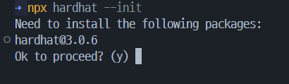
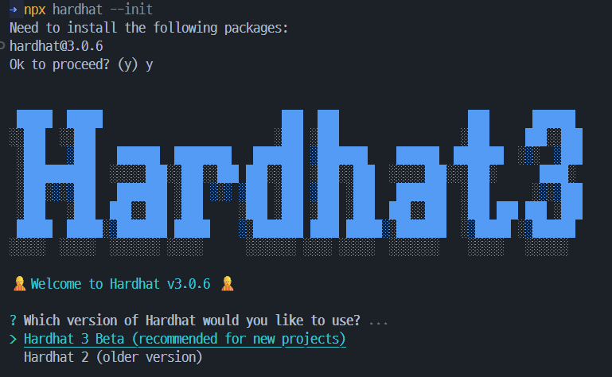
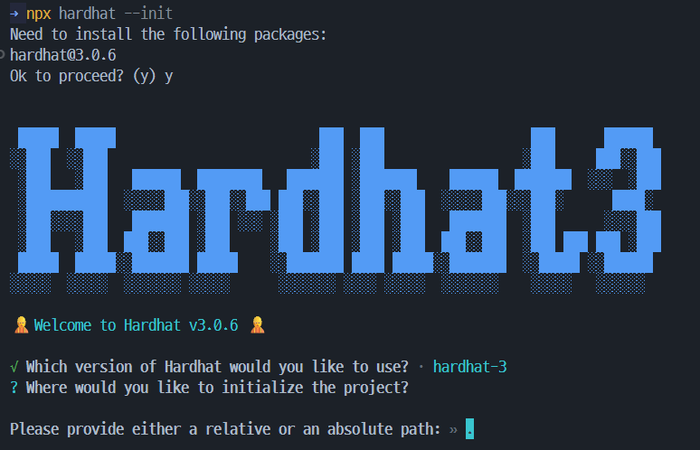
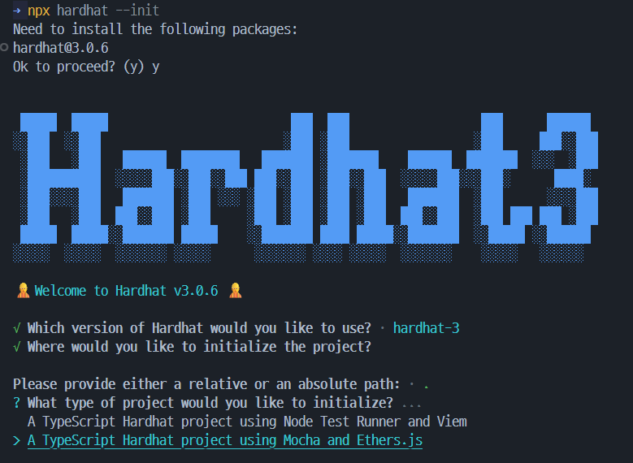
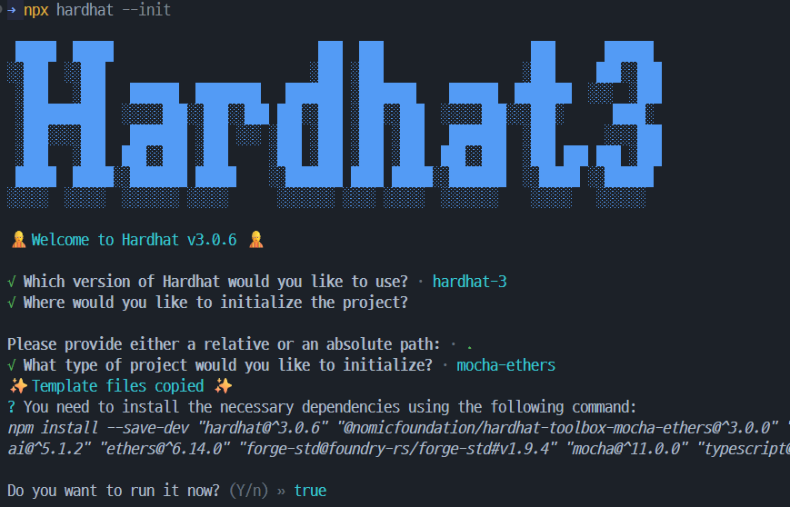
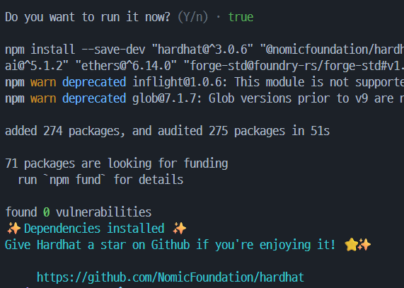
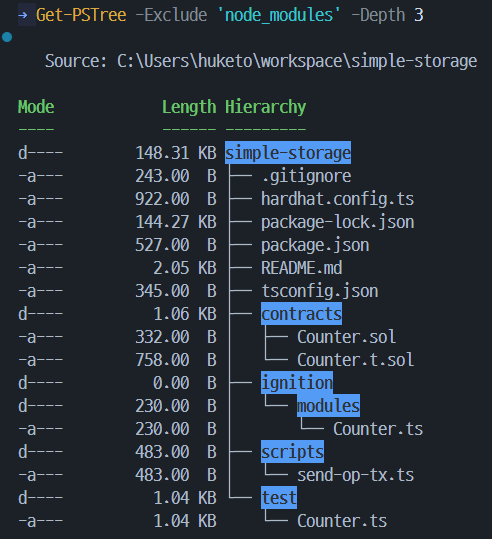

# 실무 개발 환경 구축: Hardhat

## 📜 들어가며: 왜 Hardhat을 사용할까?

스마트 컨트랙트를 개발하고, 테스트하며, 배포하는 전체 과정을 효율적으로 관리하기 위해서는 전문적인 개발 도구가 필수적입니다. **Hardhat**은 이더리움 소프트웨어 개발을 위한 강력하고 유연한 개발 환경 프레임워크입니다.

Hardhat을 사용하면 다음과 같은 이점들을 얻을 수 있습니다.

-   **로컬 이더리움 네트워크**: 실제 이더리움 네트워크와 유사한 환경을 내 컴퓨터에 빠르고 쉽게 구축할 수 있습니다. 이를 통해 실제 자산을 소모하지 않고도 컨트랙트 배포와 테스트를 무제한으로 진행할 수 있습니다.
-   **자동화된 테스트 환경**: Solidity 코드에 대한 단위 테스트 및 통합 테스트를 JavaScript(Mocha, Chai) 기반으로 쉽게 작성하고 실행할 수 있습니다.
-   **간편한 배포 스크립트**: 작성한 스마트 컨트랙트를 로컬, 테스트넷, 메인넷 등 원하는 네트워크에 손쉽게 배포할 수 있는 스크립트를 작성하고 관리할 수 있습니다.
-   **강력한 디버깅 기능**: `console.log`를 Solidity 코드 내에서 직접 사용하여 변수 값을 출력하는 등 편리한 디버깅 기능을 제공합니다.

이전 실습에서 만든 SimpleStorage 스마트 컨트랙트를 Hardhat 환경으로 옮겨와서, 실제로 배포하고 테스트하는 과정을 통해 Hardhat의 강력한 기능들을 체험해 보겠습니다.

---

## 1. 필수 도구 최종 점검

Hardhat을 사용하기 위해서는 다음과 같은 도구들이 사전에 설치되어 있어야 합니다.

- **Windows 터미널**: 최신 Windows는 기본적으로 Windows 터미널이 설치되어 있습니다. 만약 설치되어 있지 않다면, [Microsoft Store](https://aka.ms/terminal)에서 무료로 다운로드할 수 있습니다. 
-   **Node.js**: Hardhat은 Node.js 기반으로 동작합니다. [fnm(Fast Node Manager)](https://github.com/Schniz/fnm) Node.js 버전 관리 도구를 사용하여 Node.js를 설치하고 관리하는 것을 권장합니다.
-   **VSCode**: 코드 편집기로, [Solidity 확장 프로그램](https://marketplace.visualstudio.com/items?itemName=NomicFoundation.hardhat-solidity)을 설치하면 코드 하이라이팅 및 자동 완성 기능을 편리하게 사용할 수 있습니다.
-   **MetaMask**: 브라우저 확장 프로그램 형태의 암호화폐 지갑입니다. 아직 설치하지 않았다면 [공식 홈페이지](https://metamask.io/)에서 설치를 진행합니다.

### Node.js 설치 확인

터미널을 열고 다음 명령어를 입력하여 Node.js가 설치되어 있는지 확인합니다.

```powershell
$ node -v
v22.19.0 
$ npm -v
10.9.0
```

만약 Node.js가 설치되어 있지 않다면, fnm을 사용하여 설치합니다.

```powershell
# fnm 설치 (PowerShell)
$ winget install Schniz.Fnm
```

powershell 에 fnm 초기화 스크립트 추가

```powershell
# 터미널 profile 설정 파일 열기
$ notepad $PROFILE
```

`fnm env --use-on-cd | Out-String | Invoke-Expression` 내용을 복사하여 프로필 파일에 추가하고 저장한 뒤, 터미널을 재시작합니다.


최신 LTS 버전의 Node.js 설치 및 설정

```powershell
# fnm을 사용하여 Node.js 최신 LTS 버전 설치
$ fnm install --lts
Installing Node v22.19.0 (x64)
# 설치한 LTS 버전을 기본 버전으로 설정
$ fnm default v22.19.0
# 현재 터미널 세션에 적용
$ fnm use v22.19.0
```

Node.js와 npm이 정상적으로 설치되었는지 다시 한 번 확인합니다.

```powershell
# 설치 확인
$ node -v
v22.19.0
$ npm -v
10.9.0
```

---

## 2. Hardhat 프로젝트 생성 및 로컬 노드 실행

### 프로젝트 생성

- 터미널을 열고, 새로운 프로젝트를 생성할 디렉토리로 이동합니다.

```powershell
cd ~\workspace
mkdir simple-storage
cd simple-storage
```

- 다음 명령어를 순서대로 입력하여 Hardhat 프로젝트를 초기화합니다.

```powershell
# hardhat 프로젝트 초기화
npx hardhat --init
```

</br>

- `y`를 입력하고 Enter를 눌러 hardhat 패키지 설치



</br>

- `Hardhat 3 Beta (recommended for new projects)` 선택 (Enter)



</br>

- 설치 경로 기본값(현재 디렉토리) `.` (Enter)



</br>

- `↓` 방향키를 눌러 `A TypeScript Hardhat project using Mocha and Ethers.js` 선택 후 (Enter)



</br>

-  기본값 `true` (Enter)



</br>

- 설치 완료 🚀



</br>


디렉토리 구조:



```
simple-storage // 프로젝트 디렉토리 구조
├── .gitignore // Git 무시 파일
├── hardhat.config.ts // Hardhat 설정 파일
├── package-lock.json // npm 패키지 잠금 파일
├── package.json // npm 패키지 설정 파일
├── README.md // 프로젝트 설명 파일
├── tsconfig.json // TypeScript 설정 파일
├── contracts // 스마트 컨트랙트 소스 코드 디렉토리
│   ├── Counter.sol // Counter 스마트 컨트랙트
│   └── Counter.t.sol // Counter 스마트 컨트랙트 테스트 코드 (Foundry 스타일)
├── ignition // Hardhat Ignition 설정 디렉토리 - 배포를 위한 코드
│   └── Counter.ts // Counter 배포 스크립트
├── scripts // 블록체인 상에서 실행할 스크립트 디렉토리
│   └── send-op-tx.ts // 옵티미스틱 롤업 트랜잭션 전송 스크립트
└── test // 테스트 코드 디렉토리
    └── Counter.t.ts // Counter 스마트 컨트랙트 테스트 코드 (Mocha 스타일)
```

* _Foundry: Rust 로 만들어진 스마트 컨트랙트 개발 프레임워크, 빠른 컴파일 속도와 강력한 테스트 기능 제공으로 주목받고 있습니다._
* _Mocha: JavaScript 테스트 프레임워크로, 비동기 테스트 지원과 유연한 구조를 제공합니다._

---

### 명령어 설명

명령어 도움 확인

```powershell

```