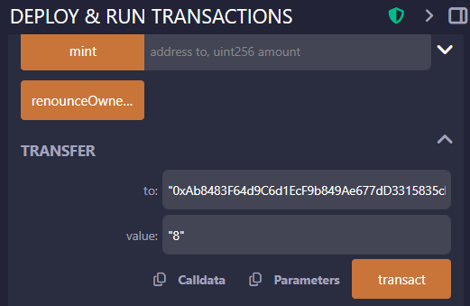

# ERC 표준 토큰 컨트랙트 개발 (ERC-20)

## 📜 들어가며: 토큰 표준은 왜 필요할까?

이더리움 블록체인 위에서는 누구나 자신만의 디지털 자산, 즉 **토큰(Token)** 을 발행할 수 있습니다. 초창기에는 개발자들이 각자 다른 방식으로 토큰을 만들었습니다. A 토큰은 `transfer()` 함수로 송금하는데, B 토큰은 `send()` 함수를 사용하는 식이었죠. 이렇게 되면 거래소나 지갑 서비스가 모든 토큰을 지원하기 위해 각각의 구현 방식에 맞춰 코드를 따로 개발해야 하는 큰 비효율이 발생합니다.

이러한 문제를 해결하기 위해 등장한 것이 바로 **ERC(Ethereum Request for Comment)** 라는 이더리움 개선 제안 표준입니다. 그중에서도 **ERC-20**은 대체 가능한 토큰(Fungible Token)이 따라야 할 **공통 인터페이스(규격)** 를 정의한 가장 대표적인 표준입니다.

**대체 가능하다(Fungible)** 는 것은, "어떤 토큰 1개가 다른 토큰 1개와 동일한 가치와 기능을 가져 서로 교환할 수 있다"는 의미입니다. 우리가 사용하는 1만 원짜리 지폐가 다른 1만 원짜리 지폐와 완전히 동일한 가치를 갖는 것과 같습니다.

모든 ERC-20 토큰이 동일한 함수 이름과 동작 방식을 갖게 되면서, 지갑, 거래소, DApp 등 이더리움 생태계의 모든 서비스들이 아주 쉽게 새로운 토큰을 통합하고 지원할 수 있게 되었습니다.

## 학습 목표

- EIP와 ERC에 대한 이해
- ERC-20 표준의 주요 함수와 이벤트 이해
- ERC-20이 활용되는 실제 사례 학습
  - 스테이블 코인
  - RWA (Real World Asset)
- OpenZeppelin 라이브러리를 활용한 안전한 ERC-20 토큰 컨트랙트 작성법
- Remix IDE 로컬 네트워크에 ERC-20 토큰 배포 및 테스트

---

## 1. EIP와 ERC란?

이더리움 네트워크가 수많은 탈중앙화 애플리케이션(dApp)과 토큰을 지원하며 원활하게 작동하는 이유는 바로 **EIP** 와 **ERC** 라는 표준화된 제안 프로세스 덕분입니다. 이 두 개념은 이더리움의 발전과 혁신에 있어 핵심적인 역할을 담당합니다.

### EIP (Ethereum Improvement Proposal)란?

**EIP** 는 '이더리움 개선 제안'의 약자로, 이더리움 네트워크의 새로운 기능, 개선 사항, 또는 프로세스 변경을 제안하는 공식적인 문서입니다. 개발자는 누구나 EIP를 제출하여 이더리움의 발전에 기여할 수 있습니다.

EIP의 주된 목적은 이더리움의 핵심 프로토콜, 클라이언트 API, 컨트랙트 표준 등을 체계적으로 논의하고 관리하여 모든 참여자가 일관된 방식으로 네트워크를 이해하고 개발할 수 있도록 돕는 것입니다. 이는 마치 새로운 법률을 제정하기 전에 거치는 입법예고 및 공청회 과정과 유사합니다.

</br>


> EIP는 Ethereum의 Github 저장소의 이슈 트래커에서 관리됩니다. EIP-20의 20은 EIP 번호를 의미합니다. 이슈 번호를 의미합니다.

---

### EIP의 종류

EIP는 제안의 성격에 따라 크게 세 가지 유형으로 나뉩니다.

1.  **표준 트랙 (Standards Track EIP)**: 이더리움 프로토콜, 네트워크, 인터페이스 등 대부분의 변경 사항에 적용되는 가장 일반적인 유형입니다. 이는 다시 여러 하위 카테고리로 나뉩니다.
    * **Core**: 합의 프로토콜 등 핵심 개발에 대한 개선안입니다.
    * **Networking**: 네트워크 프로토콜 사양에 대한 개선안입니다.
    * **Interface**: 클라이언트 API/RPC 사양 및 표준에 대한 개선안입니다.
    * **ERC (Ethereum Request for Comment)**: **가장 중요한 하위 카테고리**로, 토큰 표준과 같이 애플리케이션 수준의 표준 및 규약을 다룹니다.

2.  **메타 (Meta EIP)**: EIP 프로세스 자체나 이더리움 개발의 도구 및 환경에 대한 변경을 제안합니다.

3.  **정보성 (Informational EIP)**: 이더리움 커뮤니티에 일반적인 가이드라인이나 정보를 제공하지만, 새로운 기능을 도입하지는 않는 제안입니다.

---

### EIP의 처리 과정

하나의 아이디어가 공식적인 EIP로 채택되기까지는 다음과 같은 체계적인 단계를 거칩니다.

* **아이디어 (Idea)**: 개발자가 자신의 아이디어를 커뮤니티 포럼 등에서 비공식적으로 논의합니다.
* **초안 (Draft)**: EIP 편집자의 승인을 받아 EIP 번호를 부여받고 공식적인 초안이 됩니다.
* **검토 (Review)**: 더 넓은 커뮤니티가 제안을 검토하고 피드백을 제공합니다.
* **최종 검토 (Last Call)**: 최종 채택 전 마지막으로 피드백을 받는 단계로, 보통 2주간 진행됩니다.
* **최종 (Final)**: 모든 합의가 이루어지면 EIP는 최종 상태가 되어 이더리움 표준으로 인정됩니다.
* **유효 (Living)**: EIP 프로세스 자체처럼 지속적으로 업데이트될 수 있는 특별한 상태입니다.

이 외에도 **정체 (Stagnant)**, **철회 (Withdrawn)** 등의 상태가 있습니다.

---

### ERC (Ethereum Request for Comment)란?

**ERC** 는 '이더리움 의견 요청'의 약자로, 위에서 설명했듯이 **EIP의 하위 카테고리 중 하나**입니다. ERC는 스마트 컨트랙트와 같은 애플리케이션 수준에서 필요한 표준을 정의하는 데 중점을 둡니다.

ERC의 가장 큰 역할은 **상호운용성**을 보장하는 것입니다. 예를 들어, 모든 ERC-20 토큰이 동일한 함수 이름(`transfer`, `balanceOf` 등)과 동작 방식을 따르기 때문에, 모든 이더리움 지갑이나 탈중앙화 거래소(DEX)는 별도의 개발 없이 수많은 종류의 ERC-20 토큰을 즉시 지원할 수 있습니다.

**즉, 모든 ERC는 EIP이지만, 모든 EIP가 ERC인 것은 아닙니다.** ERC는 이더리움 생태계 내에서 dApp들이 서로 원활하게 상호작용할 수 있도록 하는 '공통 언어'와 같습니다.

---

### 주요 ERC 표준의 예시

수많은 ERC가 존재하지만, 그중에서도 이더리움 생태계에 가장 큰 영향을 미친 대표적인 표준은 다음과 같습니다.

#### ERC-20: 대체 가능한 토큰 (Fungible Token) 표준

* 가장 널리 알려진 표준으로, 우리가 흔히 아는 대부분의 암호화폐 토큰이 이 표준을 따릅니다.
* 각 토큰이 동일한 가치와 기능을 가져 서로 **대체 가능**하다는 특징이 있습니다. (예: 내 A 토큰 1개와 다른 사람의 A 토큰 1개는 가치가 같습니다.)
* 주요 기능: `balanceOf()` (잔액 조회), `transfer()` (전송), `approve()` (전송 허용량 설정) 등

#### ERC-721: 대체 불가능한 토큰 (Non-Fungible Token, NFT) 표준

* 각 토큰이 고유한 ID와 속성을 가져 서로 **대체 불가능**한 토큰을 위한 표준입니다.
* 디지털 아트, 수집품, 게임 아이템, 부동산 소유권 등 세상에 단 하나뿐인 자산을 표현하는 데 사용됩니다.
* 각 토큰이 고유하므로, `tokenID`를 통해 특정 토큰을 식별하고 소유권을 추적합니다.

#### ERC-1155: 다중 토큰 (Multi-Token) 표준

* 하나의 스마트 컨트랙트 안에서 **대체 가능한 토큰(ERC-20)과 대체 불가능한 토큰(ERC-721)을 동시에** 관리할 수 있는 효율적인 표준입니다.
* 특히 게임에서 유용한데, 예를 들어 게임 회사는 하나의 컨트랙트로 수천 개의 게임 아이템(NFT)과 게임 내 재화(Fungible Token)를 모두 발행하고 관리할 수 있습니다. 이를 통해 가스비를 절약하고 트랜잭션을 효율적으로 처리할 수 있습니다.

### 결론

**EIP** 는 이더리움이라는 거대한 도시의 법률과 건축 규정을 만드는 체계적인 프로세스이며, **ERC** 는 그 안에서 상점(dApp)들이 서로 원활하게 거래할 수 있도록 화폐(토큰)나 상품 규격을 정하는 구체적인 규칙이라고 비유할 수 있습니다.

이 두 표준이 있기에 이더리움은 탈중앙화된 방식으로 질서정연하게 발전하고, 개발자들은 혁신적인 아이디어를 자유롭게 펼치면서도 거대한 생태계와 쉽게 연결될 수 있습니다. 따라서 EIP와 ERC를 이해하는 것은 이더리움의 기술적 배경과 잠재력을 파악하는 첫걸음입니다.


## 2. ERC-20 표준의 이해

ERC-20 은 이더리움 블록체인에서 가장 널리 사용되는 대표적인 토큰 표준입니다. 이 표준은 각 토큰이 동일한 가치와 기능을 가져 서로 교환이 가능한 대체 가능한 (Fungible) 토큰을 만들기 위한 일종의 기술 규격입니다. 우리가 흔히 사용하는 화폐처럼, 내가 가진 1토큰과 다른 사람이 가진 1토큰의 가치는 완전히 동일합니다.

ERC-20의 가장 큰 힘은 상호운용성에 있습니다. 모든 ERC-20 토큰이 동일한 규칙을 따르기 때문에, 이더리움 지갑, 탈중앙화 거래소(DEX) 등 다양한 애플리케이션이 개별 토큰에 맞춰 별도의 개발을 하지 않아도 모든 ERC-20 토큰을 일관된 방식으로 지원할 수 있습니다.

이러한 표준화를 위해 ERC-20은 모든 토큰 컨트랙트가 공통적으로 갖춰야 할 인터페이스를 명확하게 정의하고 있습니다.

</br>


ERC-20 표준은 모든 토큰 컨트랙트가 반드시 구현해야 하는 **6개의 필수 함수**와 **2개의 필수 이벤트**를 정의하고 있습니다.

### **필수 함수 (Methods)**

-   **`name()`**: 토큰의 이름 (예: "My Token") - optional
-   **`symbol()`**: 토큰의 심볼 (예: "MTK") - optional
-   **`decimals()`**: 토큰의 소수점 자릿수. `18`이 일반적으로 사용됩니다. (예: 1 토큰 = 1,000,000,000,000,000,000 단위) - optional
-   **`totalSupply()`**: 토큰의 총 발행량을 반환합니다.
-   **`balanceOf(address _owner)`**: 특정 주소가 보유한 토큰의 잔액을 반환합니다.
-   **`transfer(address _to, uint256 _value)`**: 호출자의 계정에서 `_to` 주소로 `_value` 만큼의 토큰을 전송합니다.
-   **`transferFrom(address _from, address _to, uint256 _value)`**: `_from` 주소에서 `_to` 주소로 `_value` 만큼의 토큰을 전송합니다. 이 함수는 `approve()` 함수와 함께 사용되어, 다른 사람이나 컨트랙트가 나를 대신하여 토큰을 옮길 수 있도록 허용하는 데 쓰입니다.
-   **`approve(address _spender, uint256 _value)`**: `_spender` 주소(보통 스마트 컨트랙트)가 호출자의 계정에서 `_value` 만큼의 토큰을 인출할 수 있도록 위임(허용)합니다.
-   **`allowance(address _owner, address _spender)`**: `_spender`가 `_owner`의 계정에서 인출할 수 있도록 허용된 토큰의 잔여량을 반환합니다.

### **필수 이벤트 (Events)**

-   **`Transfer(address indexed _from, address indexed _to, uint256 _value)`**: 토큰이 전송될 때(발행, 소각 포함) 반드시 발생시켜야 하는 이벤트입니다.
-   **`Approval(address indexed _owner, address indexed _spender, uint256 _value)`**: `approve()` 함수가 성공적으로 호출되었을 때 발생시켜야 하는 이벤트입니다.

## 3. ERC-20의 활용 사례

### 스테이블 코인 (Stablecoin)

스테이블 코인은 가격 변동성을 최소화하도록 설계된 암호화폐입니다. 비트코인이나 이더리움과 같은 일반적인 암호화폐는 가격이 수시로 급변하여 결제 수단이나 가치 저장 수단으로 사용하기에 불안정하지만, 스테이블 코인은 미국 달러($)와 같은 법정화폐나 금과 같은 실물 자산에 그 가치를 연동(pegging)하여 1코인이 거의 항상 1달러의 가치를 유지하도록 만듭니다.

대부분의 주요 스테이블 코인은 **ERC-20 표준** 을 기반으로 발행됩니다. ERC-20의 범용성 덕분에 스테이블 코인은 수많은 탈중앙화 거래소(DEX), 디파이(DeFi) 프로토콜, 암호화폐 지갑에서 손쉽게 지원되며, 사용자들은 이를 통해 다음과 같은 활동을 할 수 있습니다.

- **안정적인 가치 저장**: 변동성이 큰 암호화폐 시장에서 자산을 안전하게 보관합니다.
- **빠르고 저렴한 송금**: 국경 없는 송금을 법정화폐보다 훨씬 빠르고 저렴하게 처리합니다.
- **디파이 생태계의 기축통화**: 디파이 서비스에서 예금, 대출, 이자 농사(Yield Farming) 등의 활동에 핵심적인 통화로 사용됩니다.

대표적인 ERC-20 기반 스테이블 코인으로는 USDT (테더), USDC (USD 코인), DAI (다이) 등이 있습니다.

### RWA (Real World Asset)

RWA는 **현실 세계의 자산(Real World Asset)**을 블록체인 위에서 토큰화한 것을 의미합니다. 부동산, 미술품, 채권, 주식, 귀금속 등 전통 금융 시장에 묶여 있던 자산들을 디지털 토큰으로 변환하여 블록체인 생태계에서 거래하거나 활용할 수 있도록 만드는 것입니다.

**ERC-20 표준**은 이러한 RWA를 토큰화하는 데에도 널리 활용됩니다. 예를 들어, 100억 원 가치의 빌딩 소유권을 100억 개의 ERC-20 토큰으로 발행하면, 투자자들은 주식처럼 1토큰 단위로 빌딩에 쉽게 투자하고 거래할 수 있습니다. 이를 통해 다음과 같은 장점을 얻을 수 있습니다.

- **유동성 증대**: 전통적으로 현금화하기 어려웠던 부동산이나 미술품 같은 비유동 자산을 잘게 쪼개어(지분화) 누구나 쉽게 거래할 수 있게 됩니다.
- **소액 투자 가능**: 고가의 자산에 대한 소액 투자가 가능해져 투자 접근성이 크게 향상됩니다.
- **효율적인 거래**: 블록체인을 통해 중개인 없이 24시간 내내 투명하고 효율적으로 자산을 거래할 수 있습니다.

이처럼 RWA는 ERC-20 표준을 활용하여 전통 자산 시장과 블록체인 기반의 디지털 금융을 연결하는 중요한 다리 역할을 하고 있습니다.

---

## 4. OpenZeppelin 라이브러리를 활용한 ERC-20 토큰 컨트랙트 작성

ERC-20 표준을 처음부터 끝까지 직접 구현하는 것은 매우 복잡하고, 사소한 실수로 인해 심각한 보안 취약점이 발생할 수 있습니다. 다행히 우리에게는 **OpenZeppelin 라이브러리**이라는 훌륭한 도구가 있습니다.

**OpenZeppelin**은 스마트 컨트랙트 보안 감사를 전문으로 하는 회사로, 자신들의 전문 지식을 바탕으로 안전하고 검증된 스마트 컨트랙트 라이브러리를 제공합니다. 이 라이브러리는 다양한 표준(ERC-20, ERC-721 등)을 구현한 코드들을 포함하고 있어, 개발자들은 이를 상속받아 간단히 자신만의 토큰을 만들 수 있습니다.

### OpenZeppelin Wizard


OpenZeppelin은 [OpenZeppelin Wizard](https://wizard.openzeppelin.com/) 라는 웹 기반 도구도 제공합니다. 이 도구를 사용하면, 몇 가지 옵션을 선택하는 것만으로도 자신만의 맞춤형 스마트 컨트랙트 코드를 자동으로 생성할 수 있습니다. 

#### ERC-20 컨트랙트 작성

OpenZeppelin Wizard에서 ERC-20을 선택하면 최초로 다음과 같은 기본 코드가 생성됩니다.

```solidity
// SPDX-License-Identifier: MIT
// Compatible with OpenZeppelin Contracts ^5.4.0
pragma solidity ^0.8.27;

import {ERC20} from "@openzeppelin/contracts/token/ERC20/ERC20.sol";
import {ERC20Permit} from "@openzeppelin/contracts/token/ERC20/extensions/ERC20Permit.sol";

contract MyToken is ERC20, ERC20Permit {
    constructor() ERC20("MyToken", "MTK") ERC20Permit("MyToken") {}
}
```

- `ERC20`과 `ERC20Permit` 컨트랙트를 상속받아, 기본적인 ERC-20 기능과 EIP-2612(permit)를 지원합니다
  - `ERC20Permit`는 사용자가 서명한 메시지를 통해 토큰 전송을 승인할 수 있게 하여, 가스비를 절약할 수 있는 기능입니다.
- `constructor` 생성자에서 토큰의 이름과 심볼을 설정합니다.
- 이 기본 코드에 추가로 원하는 기능(예: 민팅, 소각, 소유권 관리 등)을 옵션으로 선택하여 포함시킬 수 있습니다.

</br>

> 현재 코드는 토큰 발행 기능이 없으므로, 배포 후에는 토큰이 0개인 상태로 시작합니다.
> 토큰 발행 정책을 초기 발행량으로만 제한할 지, 배포 후에도 민팅 기능을 허용할 지에 따라 옵션이 달라집니다.

`Premint` 옵션에 발행량을 입력하면, 배포 시점에 해당 수량만큼 토큰이 자동으로 발행되어 배포자 주소로 할당됩니다.


```solidity
// SPDX-License-Identifier: MIT
// Compatible with OpenZeppelin Contracts ^5.4.0
pragma solidity ^0.8.27;

import {ERC20} from "@openzeppelin/contracts/token/ERC20/ERC20.sol";
import {ERC20Permit} from "@openzeppelin/contracts/token/ERC20/extensions/ERC20Permit.sol";

contract MyToken is ERC20, ERC20Permit {
    constructor(address recipient)
        ERC20("MyToken", "MTK")
        ERC20Permit("MyToken")
    {
        _mint(recipient, 100 * 10 ** decimals()); // 100 MTK를 recipient 주소로 민팅
    }
}
```

</br>


> 만약 토큰 발행을 이후에도 가능하게 하려면, `Mintable` 옵션을 선택하면 됩니다. 그러면 `mint` 함수를 호출할 수 있는 권한을 가진 `owner`(소유자) 개념이 추가됩니다.

```solidity
// SPDX-License-Identifier: MIT
// Compatible with OpenZeppelin Contracts ^5.4.0
pragma solidity ^0.8.27;

import {ERC20} from "@openzeppelin/contracts/token/ERC20/ERC20.sol";
import {ERC20Permit} from "@openzeppelin/contracts/token/ERC20/extensions/ERC20Permit.sol";
import {Ownable} from "@openzeppelin/contracts/access/Ownable.sol";

contract MyToken is ERC20, Ownable, ERC20Permit {
    constructor(address recipient, address initialOwner)
        ERC20("MyToken", "MTK")
        Ownable(initialOwner)
        ERC20Permit("MyToken")
    {
        _mint(recipient, 100 * 10 ** decimals());
    }

    function mint(address to, uint256 amount) public onlyOwner { // 오직 소유자(토큰 관리자)만 호출 가능
        _mint(to, amount);
    }
}
```

</br>

- **Mintable (발행 가능)**: 새로운 토큰을 발행(생성)할 수 있는 기능입니다. `_mint()` 내부 함수를 외부에 노출하여 특정 주소(보통 'minter' 역할을 가짐)가 토큰 공급량을 늘릴 수 있도록 허용합니다.
- **Burnable (소각 가능)**: 토큰을 영구적으로 파괴하여 총공급량에서 제거하는 기능입니다. 토큰 소유자는 자신의 토큰을 소각할 수 있으며, `approve`를 통해 허가받은 다른 계정도 소각할 수 있습니다.
- **Pausable (일시 중지 가능)**: 토큰 전송, 발행, 소각 등 토큰과 관련된 모든 활동을 일시적으로 중지하고 재개할 수 있는 기능입니다. 'pauser' 역할을 가진 계정만이 이 기능을 제어할 수 있습니다.
- **Permit (허가)**: 가스비 없는(gas-less) `approve`를 가능하게 하는 EIP-2612 표준을 구현한 기능입니다. 사용자는 별도의 `approve` 트랜잭션을 보내는 대신, 암호화된 서명(signature)을 오프체인에서 생성하여 전달할 수 있습니다. 이 서명을 받은 제3자(DApp 등)가 사용자를 대신하여 permit 함수를 호출함으로써 `approve`와 동일한 효과를 얻게 되며, 이때 발생하는 가스비는 제3자가 부담하게 됩니다.
- **Flash Minting (플래시 민팅)**: 하나의 트랜잭션 내에서 토큰을 발행(mint)했다가 즉시 소각(burn)하는 것을 조건으로, 수수료 없이 대량의 토큰을 빌릴 수 있는 기능입니다. 만약 트랜잭션이 끝나는 시점에 빌린 만큼의 토큰이 소각되지 않으면 해당 트랜잭션 전체가 실패(revert) 처리됩니다.
- **Callback (콜백)**: ERC-1363 표준을 구현한 기능으로, 토큰 전송 시 수신자가 이를 인지하고 추가 작업을 수행할 수 있도록 하는 기능입니다. 예를 들어, 토큰을 스마트 컨트랙트로 전송할 때, 해당 컨트랙트가 토큰 수신을 처리하는 로직을 포함할 수 있습니다.
  - *기존 방식 (ERC20)*: 1) 토큰 사용을 `approve` 하고, 2) 서비스 컨트랙트가 `transferFrom`으로 가져가는 2단계 방식이었습니다.
  - *ERC1363 방식*: `transferAndCall` 함수 하나만 호출하면, 토큰 전송 후 **자동으로 상대방 컨트랙트의 특정 함수(onTransferReceived)를 호출(콜백)** 해 줍니다.

---

## 5. Remix IDE 로컬 네트워크에 배포 및 테스트

이제 작성한 `MyToken`을 Remix IDE를 사용하여 로컬 네트워크에 배포하고, 주요 기능들을 테스트해 보겠습니다.


- Mintable, Burnable 옵션을 선택하여 `MyToken` 컨트랙트를 생성합니다.
- OpenZeppelin Wizard에서 `Open in Remix` 버튼을 클릭하여, 생성된 코드를 자동으로 Remix IDE로 불러옵니다.

</br>


> 실습 편의를 위해서 1 의 18승: `1 ** decimals()` 으로 설정합니다. (1 토큰 단위로 발행 및 전송 가능)
> 
> 


- Remix IDE에서 `Solidity Compiler` 탭으로 이동하여, Solidity 컴파일러 버전을 `0.8.27`로 설정한 후 `Compile MyToken.sol` 버튼을 클릭하여 코드를 컴파일합니다.
- `Deploy & Run Transactions` 탭으로 이동하여, `Deploy` 에 필요한 `recipient`와 `initialOwner` 매개변수에 각각 배포자 주소를 입력합니다.
  - 배포자 주소는 `Account` 드롭다운에서 복사 할 수 있습니다.
- `Deployed Contracts` 섹션에서 배포된 `MyToken` 컨트랙트를 확인할 수 있습니다.

### 주요 함수 테스트


- `totalSupply()` : 총 발행량 확인 (100 MTK)
- `name()` : 토큰 이름 확인 (MyToken)
- `symbol()` : 토큰 심볼 확인 (MTK)
- `decimals()` : 소수점 자리수 확인 (18)
- `balanceOf(address)` : 배포자 주소를 입력하여 잔액 확인 (100 MTK)

</br>

발행 및 소각 기능 테스트:


- `mint(address to, uint256 amount)` : `to`에 본인 주소를 입력하고, `amount`에 `10` 입력 후 `transact` 버튼 클릭 (10 MTK 민팅)
- `balanceOf(address)` : 본인 주소를 입력하여 잔액 확인 (110 MTK)
- `burn(uint256 amount)` : `amount`에 `2` 입력 후 `transact` 버튼 클릭 (2 MTK 소각)
- `balanceOf(address)` : 본인 주소를 입력하여 잔액 확인 (108 MTK)

전송 기능 테스트:

> 
> - Account 드롭다운에서 두 번째 주소를 복사하여 사용합니다.
> - 다시 첫 번째 주소로 돌아와서 테스트합니다.

</br>



- `transfer(address to, uint256 amount)` : `to`에 두 번째 주소를 입력하고, `amount`에 `8` 입력 후 `transact` 버튼 클릭 (8 MTK 전송)
- `balanceOf(address)` : 본인 주소를 입력하여 잔액 확인 (100 MTK)
- `balanceOf(address)` : 두 번째 주소를 입력하여 잔액 확인 (8 MTK)

</br>

## 참고

- [EIP (Ethereum Improvement Proposals)](https://github.com/ethereum/EIPs)
- [ERC (Ethereum Request for Comments)](https://github.com/ethereum/ERCs)
- [EIP-20: ERC-20 Token Standard](https://eips.ethereum.org/EIPS/eip-20)
- [OpenZeppelin Contracts: ERC20](https://docs.openzeppelin.com/contracts/5.x/erc20)
- [OpenZeppelin Wizard: ERC20](https://wizard.openzeppelin.com/#erc20)